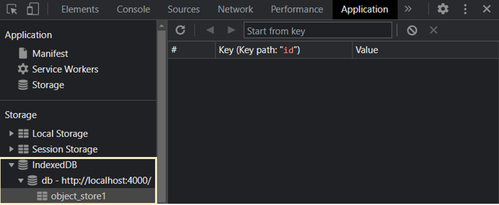

IndexedDB es una API de bajo nivel para el almacenamiento del lado del cliente de cantidades significativas de datos estructurados, incluidos **archivos/blobs**. Esta API utiliza índices para permitir búsquedas de alto rendimiento de estos datos. El estándar IndexedDB fue creado para permitir un rendimiento escalable y almacenamiento y recuperación de objetos Javascript en un navegador.

## Esquema General

<pre class="mermaid" style="display: flex; justify-content: center; background: transparent !important; border: none; box-shadow: none">
---
title: IndexedDB Esquema
---
flowchart TD
  bd1[("IDB\nDatabase")]
  --> ObjectStore1[Object Store]
  ObjectStore1 --> a[object]
  ObjectStore1 --> b[object]
  bd1 --> ObjectStore2[Object Store]
  ObjectStore2 --> c[object]
  ObjectStore2 --> d[object]
  bd1 --> ObjectStore3[Object Store]
  ObjectStore3 --> e[object]
  ObjectStore3 --> f[object]
  click bd1 href "#database" _self
  click ObjectStore1 href "#object-store" _self
  click ObjectStore2 href "#object-store" _self
  click ObjectStore3 href "#object-store" _self
  click a href "#object" _self
  click b href "#object" _self
  click c href "#object" _self
  click d href "#object" _self
  click e href "#object" _self
  click f href "#object" _self
  linkStyle default stroke: #f2f5a6
  classDef default fill:#191919,stroke:#f2f5a6,stroke-width:1px,color:#ccc
</pre>


### Database

Un contenedor de almacenes de objetos e índices. Cada base de datos tiene un nombre y una versión.

### Object Store

Un contenedor de objetos. Esto **es análogo a una tabla en una base de datos relacional**. En indexedDB, los registros corresponden a objetos Javascript y las columnas corresponden a propiedades del objeto. Los objetos agregados al contenedor se almacenan en el orden en que se agregaron. Se puede **insertar**, **actualizar** o **eliminar** objetos en un contenedor de objetos.  

### Object

Representa uno de los tipos de datos de JavaScript. Se utiliza para almacenar varias colecciones con claves y entidades más complejas.

---


## Apertura de una base de datos

Para empezara a utilizar indexedDB, primero necesitamos conectarnos o abrir una base de datos.

**Sintaxis**

{: .clipboard }

const openRequest = window.indexedDB.open(name, version)


- `name`: un string, el nombre de la base de datos
- `version`: un entero positivo predeterminado en 1

Podemos tener muchas bases de datos con nombres diferentes, pero todas ellas existen dentro del mismo origen <<`dominio/protocolo/puerto`>>. Un sitio web no puede acceder a la base de datos de otro.

La llamada retorna un objeto `openRequest`, debemos escuchar en él los eventos:

- `success`: la base de datos está lista. Hay un objeto `'database'` en `openRequest.result`
- `error`: apertura fallida.
- `upgradeneeded`: la base de datos está lista, pero su versión es obsoleta


### IndexedDB tiene incorporado un mecanismo de <<versión de esquema>>

A diferencia de las bases de datos del lado del servidor, IndexedDB se ejecuta en el lado del cliente y los datos son almacenados en el navegador así que nosotros, desarrolladores no tenemos acceso permanente a esas bases de datos. Entonces, cuando publicamos una nueva versión de la aplicación y el usuario visita nuestra página web, podemos necesitar actualizar la estructura de la base de datos.

Si la versión de la base es menor a la especificada en la función `open`, entonces se dispara un evento especial llamado `upgradeneeded` (actualización-requerida), donde podemos comparar las versiones y hacer la actualización de la estructura de datos que se necesite.

El evento `upgradeneeded` también se dispara cuando la base de datos aún no existe (técnicamente, su versión es 0), lo cual nos permite llevar a cabo su inicialización.

Digamos que publicamos la primera versión, entonces podemos abrir la base de datos con versión 1 y hacer la inicialización en un manejador `upgradeneeded`:  

{: .clipboard }

let openRequest = indexedDB.open("store", 1);

openRequest.onupgradeneeded = function() {
  // se dispara si el cliente no tiene la base de datos
  // ...ejecuta la inicialización
}

openRequest.onerror = function() {
  console.error("Error", openRequest.error)
}

openRequest.onsuccess = function() {
  let db = openRequest.result;
  // continua trabajando con la base de datos usando el objeto db
}


Luego, más tarde, publicamos la segunda versión.

Podemos abrirla con la versión 2 y ejecutar la actualización así:


{: .clipboard }
```js
let openRequest = indexedDB.open("store", 2);

openRequest.onupgradeneeded = function(event) {
  // la versión de la base de datos existente es menor que 2  (o ni siquiera existe)
  let db = openRequest.result;
  switch(event.oldVersion) {
    case 0:
    // version 0 significa que el cliente no tiene la base de datos
    // ejecutar la inicialización
    case 1:
    // el cliente tiene la versión 1
    // actualizar
	}
};
```

Tenerlo en cuenta: como nuestra versión es 2, el manejador `onupgradeneeded` tiene una rama de código para la versión 0, adecuada para usuarios que acceden por primera vez y no tienen una base de datos, y otra rama para la versión 1, para su actualización.

Entonces, y solamente si el manejador `onupgradeneeded` finaliza sin errores, se dispara el evento `openRequest.onsuccess` y se considera que la base de datos fue abierta con éxito.

Para borrar la base de datos:

{: .clipboard }
```js
let deleteRequest = indexedDB.deleteDatabase(name);
// deleteRequest.onsuccess/onerror rastrea el resultado
```

---

## Actualización de la versión de base de datos

Cuando se crea una nueva base de datos o se aumenta el número de versión de una base de datos existente (mediante la especificación de un número de versión más alto), el evento `onupgradeneeded` se activará y un [`IDBVersionChangeEvent`](https://developer.mozilla.org/en-US/docs/Web/API/IDBVersionChangeEvent){:target='_blank' class='link'} será pasado al controlador de eventos `onversionchange` establecido en `request.result`. En el controlador para el evento `onupgradeneeded`, se debe crear los almacenes de objetos necesarios para esta versión de la base de datos:

{: .clipboard }
```js
// Este evento solamente se activará al cambiar de versión
request.onupgradeneeded = function (event) {
  var db = event.target.result;

  // Crea un almacén de objetos (objectStore) para esta versión de base de datos
  var objectStore = db.createObjectStore("name", { keyPath: "myKey" });
};
```

Podemos ver esto de mejor manera en el siguiente caso, donde en primera instancia tenemos una base de datos inicial con un almacén creado:



Si nos detenemos a revisar lo anterior, abriendo las herramientas de desarrollador ( <kbd>ctrl</kbd> + <kbd>shift</kbd> + <kbd>i</kbd> ) en la pestaña de aplicación encontraremos que efectivamente se creó nuestro almacén de datos `object_store1`.





---

## Almacén de objetos

Para almacenar algo en indexedDB, necesitamos un **almacen de objetos** (*object store*).

Un almacen de objetos es un concepto central de indexedDB. Equivale a lo que en otras bases de datos se denominan **tablas** o **colecciones**. Es donde los datos son almacenados. Una base de datos puede tener múltiples almacenes: uno para usuarios, otro para bienes, etc.

A pesar de llamarse **almacén de objetos**, también puede almacenar tipos primitivos. Podemos almacenar casi cualquier valor,incluyendo objetos complejos

IndexedDB usa el algoritmo de serialización estándar para clonar-y-almacenar un objeto. Es como [`JSON.stringify`](https://developer.mozilla.org/en-US/docs/Web/JavaScript/Reference/Global_Objects/JSON/stringify){:target='_blank' class='link'} pero más poderoso, capaz de almacenar muchos tipos de datos más.

Hay objetos que no pueden ser almacenados, por ejemplo los que tienen referencias circulares. Tales objetos no son serializables.[`JSON.stringify`](https://developer.mozilla.org/en-US/docs/Web/JavaScript/Reference/Global_Objects/JSON/stringify){:target='_blank' class='link'} también falla con ellos.


Una clave debe ser uno de estos tipos: `number`, `date`, `string`, `binary`, o `array`. Es un identificador único, así podemos **buscar**/**borrar**/**modificar** valores por medio de la clave.


Como veremos en breve, cuando agregamos un valor al almacén podemos proporcionarle una clave, de forma similar a `localStorage`. Pero cuando lo que almacenamos son objetos, IndexedDB permite asignar una propiedad al objeto como clave, lo que es mucho más conveniente. También podemos usar claves que se generan automáticamente.

Pero primero, necesitamos crear el almacén de objetos.

---

## Crear un almacén de objetos


La sintaxis para crear un almacén de objetos u `object store`:

```js
db.createObjectStore(name[, keyOptions]);
```


Ten en cuenta que esta operación es sincrónica, no requiere `await`.

- `name`: es el nombre del almacén, por ejemplo: **books**.
- `keyOptions`: es un objeto opcional con una de estas dos propiedades:
	- `keyPath`: la ruta a una propiedad del objeto que IndexedDB usará como clave, por ejemplo **id**.
	- `autoIncrement`: si es `true`, la clave para el objeto nuevo que se almacene se generará automáticamente con un número autoincrementable.


> Si no establecemos `keyOptions`, necesitaremos proporcionar una clave explícitamente más tarde: al momento de almacenar un objeto.


Por ejemplo, creamos un almacén de objeto que use la propiedad `id` como clave:

{: .clipboard }
```js
db.createObjectStore('books', {keyPath: 'id'})
```

Veamos un caso mínimo de como sería crear el almacén de objetos anterior:



Si abrimos el navegador y revisamos la consola ( <kbd>ctrl</kbd> + <kbd>shift</kbd> + <kbd>i</kbd> ) en la pestaña de **aplicación**, observaremos que se creó el almacén **books**:


La API de indexedDB está diseñada para disminuir la necesidad de manejo de errores, por lo que es probable que no veamos muchos eventos de error.


## Descripción general de una solicitud a la bas de datos

<pre class="mermaid" style="display: flex; justify-content: center; background: transparent !important; border: none; box-shadow: none">
flowchart TD
  open_con("Abrir una conexión")
  --> open_tsn("Abrir una transacción de lectura o escritura (read only/read write)")
  --> open_cur("Abrir un cursor para iterar sobre un almacén o índice (all data/index)")
  --> data_here("Los datos encontrados están a dispoción")
  linkStyle default stroke: #f2f5a6
  classDef default fill:#191919,stroke:#f2f5a6,stroke-width:1px,color:#ccc
</pre>


### Transacciones

El término transacción es genérico, usado por muchos tipos de base de datos. Una transacción es un grupo de operaciones cuyos resultados están ligados al concepto de que todas las operaciones deben ser exitosa o todas fallar.


Por ejemplo, cuando una persona compra algo, necesitamos:

- Restar el dinero a la cuenta personal.
- Agregar el ítem a su inventario

Sería muy malo que se completara la primera operación y algo saliera mal (como un corte de luz), fallara la segunda. Ambas deberían ser exitosas (compra completa) o ambas fallar (mantiene el dinero y puede reintentar).

> Las transacciones nos garantizan la seguridad en las operaciones.

### Todas las operaciones deben ser hechas dentro de una transacción en IndexedDB.


Para iniciar una transacción:

```js
db.transaction(store[, type]);
```

- `store`: el nombre del almacén al que la transacción va a acceder, por ejemplo "books". Puede ser un array de nombres de almacenes si vamos acceder a múltiples almacenes.
- `type`: el tipo de transacción, uno de estos dos:
	+ `readonly`: solo puede leer (es el predeterminado)
	+ `readwrite`: puede leer o escribir datos (pero no crear/quitar/alterar almacenes de objetos)
	
También existe el tipo de transacción `versionchange`: tal transacción puede hacer de todo, pero no podemos crearla nosotros a mano. IndexedDB la crea automáticamente cuando abre la base de datos para el manejador `upgradeneeded`. Por ello, es el único lugar donde podemos actualizar la estructura de base de datos, crear o quitar almacenes de objetos.

### ¿Porque hay diferentes tipos de transacciones?

El rendimiento es la razón por la que necesitamos identificar las transacciones como `readonly` o `readwrite`. Muchas transacciones `readonly` pueden leer en un mismo almacén concurrentemente, en cambio las transacciones de escritura `readwrite`, no. Una transacción `readwrite` bloquea el almacén para escribir en él. La siguiente transacción debe esperar a que la anterior termine antes de acceder al mismo almacén.

Una vez la transacción ha sido creada, podemos agregar un ítem al almacén:

{: .clipboard }
```js
{{ site.data.examples.js.indexeddb.tsn_add }}
```

Básicamente hay 4 pasos:

- 1) Crea una transacción, mencionando todos los almacenes a los que irá a acceder - `(1)`
- 2) Obtiene el almacén usando `transaction.objectStore(name)` - `(2)`.
- 3) Ejecuta la petición al almacén `books.add(book)` - `(3)`.
- 4) Maneja el éxito o fracaso de la petición - `(4)`

Los almacenes de obejtos soportan dos métodos para almacenar un valor:

- `put(value, [key])`: agrega `value` al almacén. La clave `key` debe ser suministrada solo si el almacén no se le asignó la opción `keyPath` o `autoIncrement`. Si ya hay un valor con la misma clave, este será remplazado.
- `add(value, [key])`: lo mismo que `put`, pero si ya hay un valor con la misma clave, la petición fallará y se genera un error con el nombre de `ConstraintError`.


Al igual que al abrir una base de datos, podemos enviar una petición: `books.add(book)` y quedar a la espera de los eventos `success/error`.

- El resultado `request.result` de `add` es la clave del nuevo objeto.
- El error, si lo hay, está en `request.error`


### Commit, culminación automática de las transacciones

En el ejemplo anterior, empezamos la transacción e hicimos una petición `add`. Pero como sabemos, una transacción puede tener muchas peticiones asociadas, que deben todas resultar exitosa o todas fallar. ¿Cómo marcamos que una transacción se da por finalizada, que no tendrá más peticiones asociadas?

Respuesta corta: no lo hacemos

En la siguiente versión 3.0 de la especificación, probablemente haya una manera de finalizarla manualmente, en la 2.0 no la hay.

Cuando todas las peticiones de una transacción terminaron y la cola de microtareas está vácia, se hace un commit automático.

De forma general, podemos asumir que una transacción se consuma cuando todas sus peticiones fueron completadas y el código actual finaliza.

Entonces, en el ejemplo anterior no se necesita una llamada especial para finalizar la transacción.

El principio de **auto-commit** de las transacciones tiene un efecto colateral importante. No podemos insertar una operación asincrónica como `fetch`, `setTimeout` en mitad de una transacción. IndexedDB no mantendrá la transacción esperando a que terminen.

En el siguiente código, en la línea con el comentario `(*)` falla, porque la transacción ya está finalizada y no podemos hacer más peticiones sobre ella:


{: .clipboard }
```js
let request1 = books.add(book);

request1.onsuccess = function() {
  fetch('/').then(response => {
    let request2 = books.add(anotherBook); // (*)
    request2.onerror = function() {
      console.log(request2.error.name); // TransactionInactiveError
    }
  })
}
```

## Obtener datos desde el almacen

Cuando un almacén de datos contiene información, se puede recuperar de varias maneras. Primero tenemos el método `get()` que recibe la clave para recuperar el valor, en el siguiente ejemplo veremos el código para recuperar el valor proporcionando una clave: 

```js
let transaction = db.transaction(["books"]);
let objetStore = transaction.objectStore("books");
let request = objectStore.get("3");

request.onerror = (event) => {
  // handle error
}

request.onsuccess = (event) => {
  alert("El registro con id 3 es ", request.result.name)
}
```

Como se puede apreciar resulta ser mucho código para recuperar un simple valor. Ahora si queremos acortarlo un poco, podemos hacer lo siguiente:

```js
db
  .transaction(["books"])
  .objectStore("books")
  .get("3").onsuccess = (e) => {
    alert("El registro con id 3 es", e.target.result.name) 
  }
```

### Uso de un cursor

EL uso del método `get()` requiere que sepamos la clave del registro a recuperar. Si queremos recorrer todos los valores en el almacén de objetos, podemos usar un cursor como se puede ver en el siguiente ejemplo:

```js
let objectStore = db.transaction("books").objectStore("books");

objectStore.openCursor().onsuccess = (e) => {
  const cursor = e.target.result;
  if (cursor) {
    alert("Nombre de la clave", cursor.key, "Nombre del libro", cursor.value.name)
  } else {
    alert("No hay más registros")
  }
} 
```

La función `openCursor()` toma varios argumentos. Primero puede limitar el rango de elementos que se recuperan usando un objeto de rango. En segundo lugar, se puede especificar la dirección en la que se desea iterar.


### IDBObjectStore.put()

El método `put()` de la interfaz **IDBObjectStore** actualiza un registro en una base de datos, o inserta un nuevo registro si el elemento dado aún no existe.

Tenga en cuenta que si tiene un **IDBCursor** para el registro que desea actualizar, es preferible actualizarlo con el método **IDBCursor.update()** en vez de **IDBObjecStore.put()**. Al hacerlo, queda claro que se actualizará un registro existente, en lugar de que se inserte un nuevo registro.


### Ejemplos

El siguiente ejemplo solicita un título de un registro determinado; cuando esa solicitud tiene exito, la función **onsuccess** obtiene el registro asociado de **IDBObjectStore** (disponible a través del evento como `e.target.result`), actualiza una propiedad del registro y luego vuelve a **put()** y el registro se actualiza en el almacen de objetos con otra solicitud