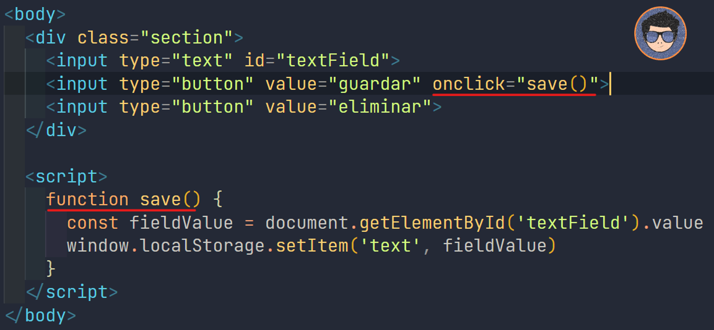
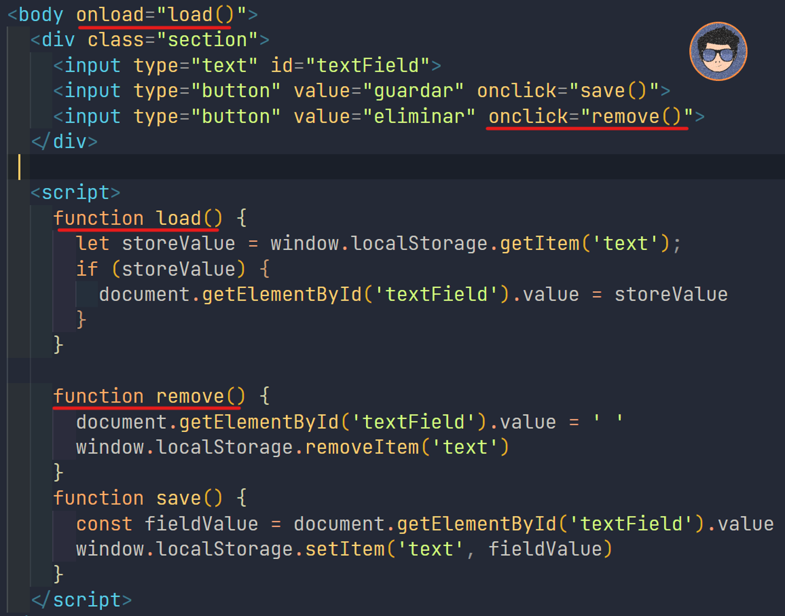

## INTRODUCCIÓN AL STORAGE TYPE

La interfaz de `Storage` proporciona acceso a la sessión o al almacenamiento local de un dominio particular. Permite agregar, modificar o eliminar datos almacenados.

Para manipilar, por ejemplo, el almacenamiento de sesiones de un dominio, se utiliza `window.sessionStorage`; mientras que para el almacenamiento local la llamada se realiza a `window.localStorage`.

El tipo `Storage` está diseñado para almacenar pares de clave/valor. El tipo `Storage` es un objeto (_`Object`_) con los siguientes métodos:  

- `setItem(name, value)` - establece el valor para un nombre.
- `removeItem(name)` - eliminar el par nombre-valor identificado por nombre.
- `getItem(name)` - obtener el valor de un nombre dado.
- `key(index)` - obtener el nombre del valor en la posición numérica dada.
- `clear()` - eliminar todos los valores.


## LOCALSTORAGE VS SESSIONSTORAGE

`Window.localstorage` o simplemente `localStorage` almacena datos para siempre hasta que la aplicación los borre. Esto es diferente a **`sessionStorage`** donde se borra el almacenamiento cuando se cierra el navegador. Además, los datos permanecen sincronizados si el usuario tiene varias pestañas abiertas de la misma aplicación.

---

## ALMACENAMIETO EN LOCALSTORAGE

El método `localStorage.setItem()` permite almacenar datos en pares de clave y valor donde tanto la clave como el valor deben estar en formato de `string`. Para almacenar un objeto **JSON** en el almacenamiento local, primero debemos convertirlo en una cadena usando el método `JSON.stringfy()`.


**Ejemplo:** almacenar una cadena simple

{: .clipboard }
```js
localStorage.setItem("user", "EniDev911");
```

**Ejemplo:** almacenar un objeto JSON:

{: .clipboard }
```js
localStorage.setItem('userdetails',
	JSON.stringify({city: 'Santiago', country: 'Chile'}))
```

---

## ELIMINAR DE LOCALSTORAGE

Para eliminar el elemento de `localStorage`, podemos usar el método `.removeItem()` este método acepta la clave (*key*) en formato de cadena como argumento:


{: .clipboard }
```js
localStorage.removeItem('key')
```

Para eliminar todos los valores simplemente llamamos al método `.clear()`:

{: .clipboard }
```js
localStorage.clear()
```

---

## EJEMPLO CON LOCALSTORAGE

En esta ejemplo, vamos a crear un campo de entrada y dos botones, uno para guardar y otro para eliminar y vincular nuestro archivo CSS y JS para darle apariencia y luego la funcionalidad:




{{ site.data.examples.js.localstorage.pd_index_html }} 




{{ site.data.examples.js.localstorage.pd_index_css }} 




{{ site.data.examples.js.localstorage.pd_index_js }} 






Cumplido con lo anterior en el siguiente paso implementaremos la funcionalidad para guardar la entrada del usuario. Para ello utilizaremos **localStorage**.

{: .clipboard }
```js
function save(){
	const fieldValue = document.getElementById('textField').value
	window.localStorage.setItem('text', fieldValue)
}
```

Ahora usamos el atributo `onclick` en el botón correspondiente para invocar la función:



En el navegador, escribimos en el campo de entrada algún texto y hacemos clic en el botón guardar y se guardará el nombre en el almacenamiento local del navegador. Para poder verificarlo, podemos abrir el panel de herramientas de desarrollador con la combinación <kbd>Ctrl</kbd> + <kbd>Shift</kbd> + <kbd>i</kbd> y luego buscar la pestaña **aplicación**.


Se puede observar que en el almacenamiento local hay un valor y una clave. Ahora, si cierra el navegador y lo abre de nuevo, podemos ver que el valor aún permanece allí. Eso significa que implementamos con éxito nuestra funcionalidad. Pero si intenta eliminarlo, simplemente no hará nada porque aún no lo implementamos.

En este punto desarrollaremos la funcionalidad para obtener el valor en **localStorage** y también la de eliminación:   

{: .clipboard }
```js
function load(){
	let storeValue = window.localStorage.getItem('text');
	if(storeValue){
		document.getElementById('textField').value = storeValue
	}
}

function remove(){
	document.getElementById('textField').value = ' '
	window.localStorage.removeItem('text')
}
```

{:height='600'}

Con esto implementamos la funcionalidad de cargar `load()` y eliminar `remove()` para que cuando un usuario haga clic en el botón Eliminar, elimine el elemento del campo de entrada y también del almacenamiento local.

Ahora si queremos guardar más de 1 valor, nos encontraremos con el problema de que cada vez que se presiona el botón guardar el último valor sobreescribe al que ya existe, y esto pasa porque estamos usando el mismo nombre para la clave en este caso **"text"**.