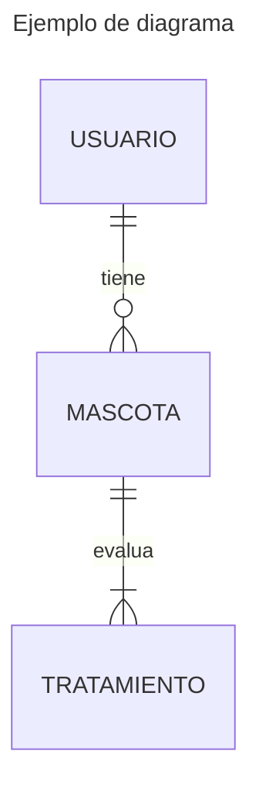

<style>
  .mermaid {
    background: #f2f2f2;
    margin: 15px 0;
    width: fit-content;
  }
</style>

Es una herramienta para gráficos y diagramas basada en **JavaScript** que presenta definiciones de texto inspiradas en Markdown para crear y modificar diagramas dinámicamente.

### Herramientas que ofrece mermaid

- [Mermaid Live Editor](https://mermaid.live/)
- [Guía para principiantes](https://mermaid.js.org/community/n00b-overview.html)
- [CDN para integrar de forma rápida](https://www.jsdelivr.com/package/npm/mermaid)


### Ejemplo usando con la CDN

```html
<!DOCTYPE html>
<html lang="en">
<head>
  <meta charset="UTF-8">
  <meta name="viewport" content="width=device-width, initial-scale=1.0">
  <title>Demo mermaid</title>
  <script src="https://cdn.jsdelivr.net/npm/mermaid@10.2.2/dist/mermaid.min.js"></script>
</head>
<body>
  <pre class="mermaid">
    graph TD
    A[Client] --> B[Load Balancer]
    B --> C[Server01]
    B --> D[Server02]
  </pre>
</body>
</html>
```

**RESULTADO**

  <pre class="mermaid">
    graph TD
    A[Client] --> B[Load Balancer]
    B --> C[Server01]
    B --> D[Server02]
 </pre>

---

### Ejemplos de diagramas usando Markdown


**Diagrama de flujo** 

````markdown

````

<pre class="mermaid">
graph TD;
    A-->B;
    A-->C;
    B-->D;
    C-->D;
 </pre>


**Diagrama de entidad relación**

Es importante que nombremos las entidades usando sustantivos singulares, ya que técnicamente una entidad es una *instancia abstracta* de un tipo de entidad:


````markdown

````

<pre class="mermaid" style="display: flex; justify-content: center;">
---
title: Ejemplo de diagrama
---
erDiagram
    USUARIO ||--o{ MASCOTA : tiene
    MASCOTA ||--|{ TRATAMIENTO : evalua
</pre>