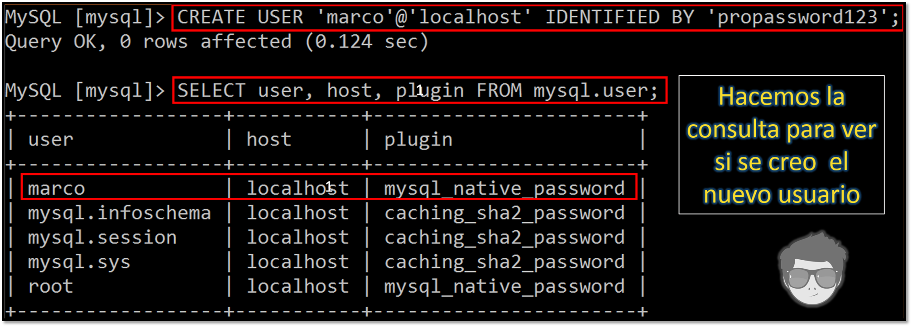
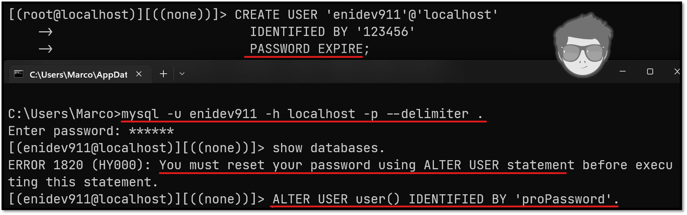
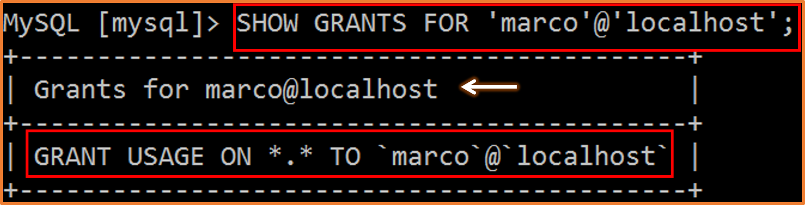
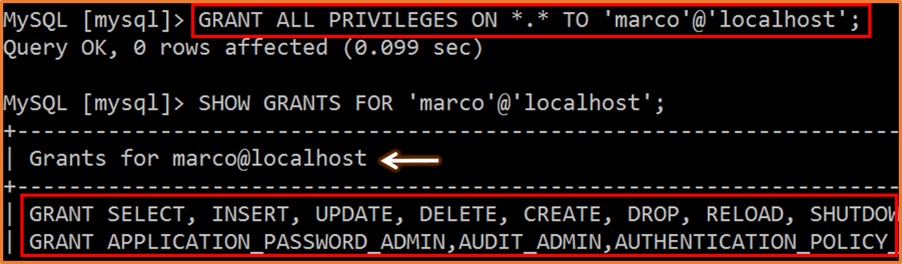
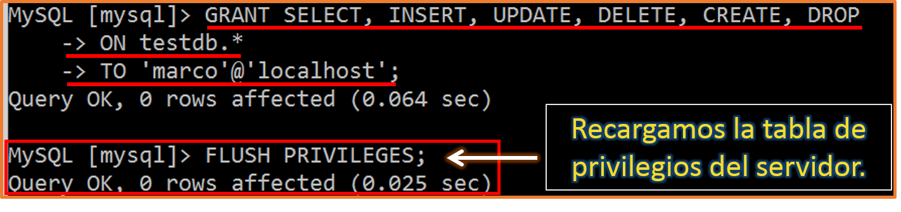
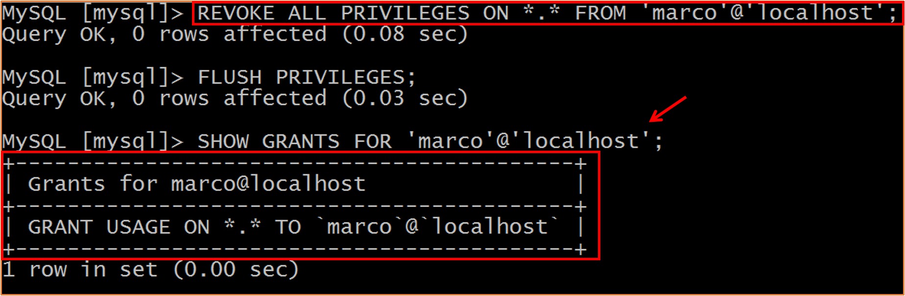
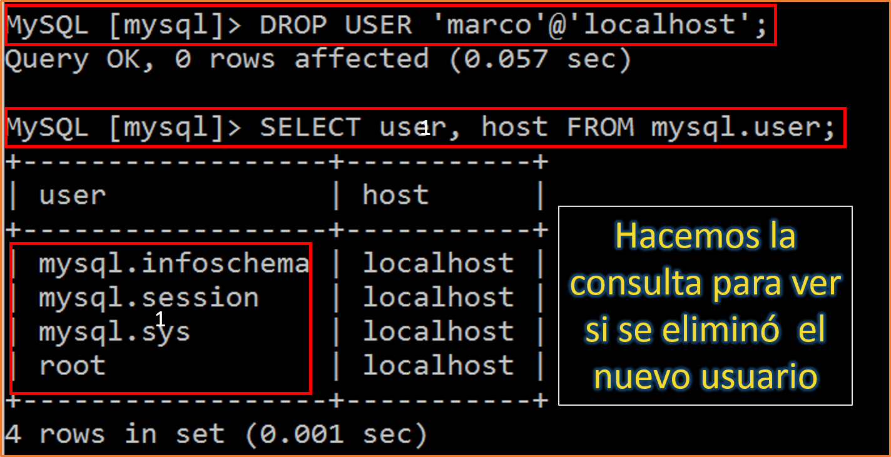

[comment]: <> (Author: Marco Contreras Herrera)
[comment]: <> (Email: enidev911@gmail.com)

[](../)

<a name="top"></a>
## CONTENIDO

- [Introducción](#intro)
- [Crear usuario](#crear-usuario)
- [Cambiar nombre de usuario existente](#cambiar-nombre-usuario)
- [Privilegios](#privilegios)
    + [asignar](#asignar-privilegios)
    + [revocar](#revocar-privilegios)
- [Borrar usuario](#drop-user)


<a name="intro"></a>
## Introducción

MySQL permite la creación de cuentas que habilita a los usuarios conectarse desde un cliente al servidor y acceder a las bases de datos donde cuyo usuario tenga autorización y privilegios administrativos correspondiente para gestionar el servidor. La función principal del sistema de privilegios de MySQL es autenticar a un usuario que se conecta desde un host determinado y asociar a ese usuario con privilegios en una base de datos, privilegios como **`SELECT`**, **`INSERT`**, **`UPDATE`**, **`DELETE`**. La funcionalidad adicional incluye la capacidad de otorgar privilegios para operaciones administrativas.  

Cuando un usuario administrativo crea una nueva cuenta de usuario en MySQL, esta cuenta se almacena en la tabla **`user`** en la base de datos **`mysql`** del sistema. Una cuenta se define en términos básicos como un nombre de usuario y el host o hosts del cliente desde los cuales el usuario puede conectarse al sevidor. Una cuenta también puede tener credenciales de autenticación, como una contraseña. Las credenciales son manejadas por el complemento de autenticación de cuenta al momento de su creación.

En el proceso de instalación de MySQL llena las tablas de concesión con una cuenta **`root`** inicial. A partir de entonces, normalmente puede crear otras cuentas.  

>NOTA: Las contraseñas almacenadas en la tabla **`user`** se cifran mediante algoritmos específicos del complemento.

[](#top)

---

<a name="crear-usuario"></a>
## Crear usuarios


Por medio del comando **`CREATE USER`** podemos crear y configurar un usuario de bases de datos (siempre y cuando tengamos los privilegios correspondientes), que es una cuenta a través de la cual un nuevo usuario puede iniciar sesión y se le puede asignar una contraseña por medio de la cláusula **`IDENTIFIED BY`**, si desea que la contraseña se guarde en texto plano, la contraseña se guardará cifrada con el valor hash que es devuelto por la función **`Password()`**.  
Para cada cuenta que se crea con **`CREATE USER`** se ingresa una nueva fila en la tabla **`user`** en la base de datos de sistema **`mysql`**. La fila de la cuenta refleja las propiedades especificadas en el momento de su creación. Las propiedades no especificadas se establecen en sus valores predeterminado.

Comenzaremos con abrir una nueva conexión al servidor por medio del símbolo del sistema en Windows o la Terminal en Linux, luego nos conectamos con el usuario administrador para llevar a cabo la tarea de crear nuevas cuentas de usuarios.

Debemos conectarnos **con el usuario root del servidor MySQL**:

En windows debemos indicar el usuario con el flag **-u** y luego el flag **-p** para que nos solicite la password:
```cmd
mysql -u root -p
```

En linux como el plugin de autenticación es **auth** al momento de instalarse, entonces solo debemos invocar a mysql con privilegios de administrador:

```bash
sudo mysql
```


Una vez conectado al servidor estamos en condiciones para crear usuarios, la sintaxis para ello es muy sencilla.

### Sintaxis

```sql
CREATE USER 'user'@'host' IDENTIFIED BY 'passworduser';
```

### Ejemplo n°1:

Crear una cuenta que use el complemento de autenticación predeterminado y una contraseña.  

```sql
CREATE USER 'marco'@'localhost' IDENTIFIED BY 'propassword123'
```

<p align="center">
    <br>
    (Creando un nuevo usuario)
</p>

### Ejemplo n°2:

Crear una cuenta que use el complemento de autenticación predeterminado y la contraseña proporcionada la marcaremos como caducada para que el usuario deba elegir una nueva en la primera conexión al servidor:  


<p align="center">
    <br>
    (Creando un nuevo usuario con contraseña expirada)
</p>

Si queremos modificar a un usuario existente para que el password sea **EXPIRE** al conectarse, lo podemos hacer por medio de la siguiente sentencia: 

```sql
ALTER USER 'lukas'@'localhost' PASSWORD EXPIRE;
```

Las cuentas de usuarios han sido creadas, sin embargo a pesar de que estos nuevos usuarios puedan conectarse al servidor no podrán ejecutar setencias *sql* o ver las bases de datos existentes, ya que para eso primero hace falta asignarle los diferentes privilegios, para que puedan realizar cualquier tipo de tarea. 


---

<a name="cambiar-nombre-usuario"></a>
## Cambiar el nombre de un usuario

En MySQL tenemos la instrucción `RENAME USER` que puede ser utilizada por un usuario administrador del servidor para cambiar el nombre de usuario o el host de una cuenta de usuario de MySQL existente sin alterar sus privilegios.


### Ejemplo

```sql
RENAME USER 'bobba-fett'@'host' TO 'boba-fett'@'host';
```

[](#top)

---

<a name="privilegios"></a>
## Otorgar privilegios de usuarios

Antes de comenzar a otorgar privilegios a nuestros usuarios, es importante tener en cuenta ciertas definiciones que están relacionadas con la tarea de administrar usuarios como lo es el término **DCL**.  

### ¿Qué es DCL?

**DCL** (*Data Control Language*) son comandos SQL que permiten al administrador **controlar el acceso a los datos contenidos en la base de datos** principalmente son dos: 

- **GRANT**: Usado para otorgar privilegios de acceso al usuario para realizar tareas determinadas en las bases de datos permitidas.

- **REVOKE**: Permite eliminar permisos o privilegios que han sido previamente concedido con **GRANT**.

Algunas de las tareas sobre las que se pueden conceder o denegar permisos son las siguientes:  

**`CONNECT`,  `SELECT`, `INSERT`, `UPDATE`, `DELETE`, `USAGE`**

Para ver una lista más detallada de todos los privilegios que pueden ser asignado a una cuenta, use el siguiente comando:

```sql
SHOW PRIVILEGES;
```

Para ver los privilegios asignados al usuario conectado con el comando:


```sql
SHOW GRANTS;
```

Para consultar los permisos que tiene otro usuario con el siguiente comando (*debe poseer permisos para realizar este comando*):  


```sql
SHOW GRANTS FOR 'user_name'@'host_name';
```

<p align="center">
    <br>
    (Consultando los permisos del nuevo usuario creado)
</p>

---

<a name="asignar-privilegios"></a>
## Asignar privilegios a un usuarios

Para asignar privilegios a una cuenta usamos el comando dcl **`GRANT`**, el cual permite asignar a una cuenta diferentes servicios, siendo de tipo:  


### Globales

Otorga los privilegios a un usuario sobre todo el servidor: 

```sql
GRANT ALL PRIVILEGES ON *.* TO 'username'@'localhost';
```
los asteriscos indican que los permisos serán asignados a todas las bases de datos y a todas las tablas (primer asteriscos bases de datos, segundo asterisco tablas). 

<p align="center">
    <br>
    (ejemplo con el usuario creado en la sección <a href="#crear-usuario">crear usuario</a>)
</p>

### Locales

Si queremos asignar permisos para ciertas acciones, la sentencia quedaría de la siguiente manera (reemplazamos **`ALL PRIVILEGES`** y colocamos las acciones que queremos asignar):

```sql
GRANT SELECT, INSERT ON userdb.* TO 'username'@'localhost';
```

Una vez hayamos finalizado con los permisos, el último paso será refrescarlos: 

```sql
FLUSH PRIVILEGES;
```

<p align="center">
    <br>
    (ejemplo con el usuario creado en la sección <a href="#create-user">crear usuario</a>)
</p>

---

<a name="revocar-privilegios"></a>
## Revocar privilegios a un usuarios


Para borrar los privilegios de una cuenta con la sentencia:

```sql
REVOKE privileges ON *.* FROM 'username';
```

Remover permisos en concreto (Ejemplo create y delete):  

```sql
REVOKE CREATE, DELETE ON *.* FROM 'username'@'localhost';
```

Remover todos los privilegios:  

```sql
REVOKE ALL PRIVILEGES ON *.* FROM 'username'@'localhost';
```
<p align="center">
    <br>
    (ejemplo con el usuario creado en la sección <a href="#create-user">crear usuario</a>)
</p>


## <a name="drop-user"></a> Borrar usuarios

De igual forma para crear usuarios, necesitamos  tener los permisos pertinentes para poder borrarlos, borrar a un usuario utilzamos la sentencia **`DROP USER`**:  

```sql
DROP USER 'user'@'localhost';
```

<p align="center">
    <br>
    (ejemplo con el usuario creado en la sección <a href="#crear-usuario">crear usuario</a>)
</p>


