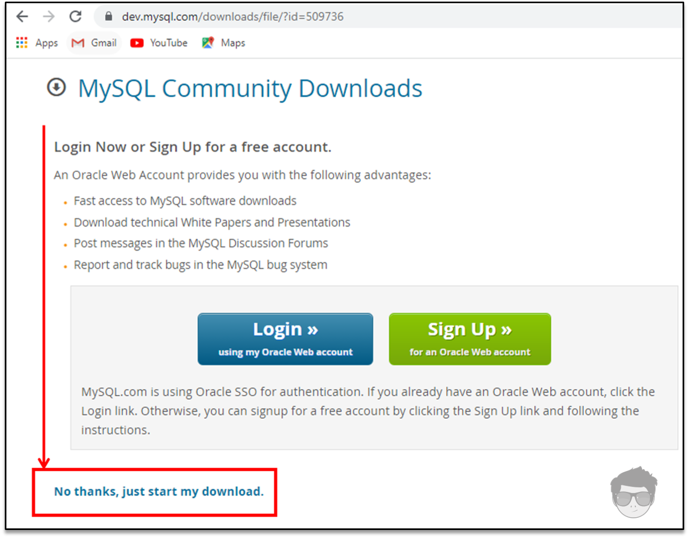
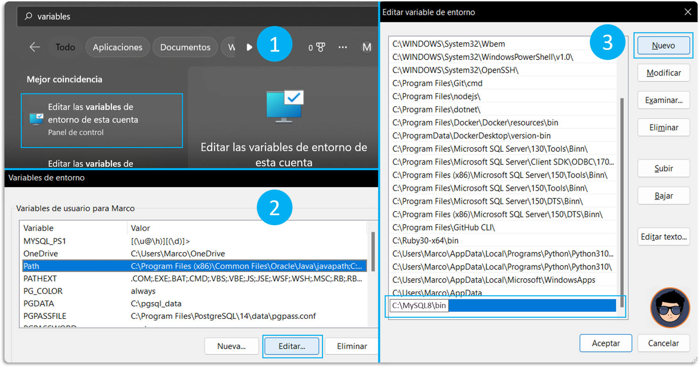
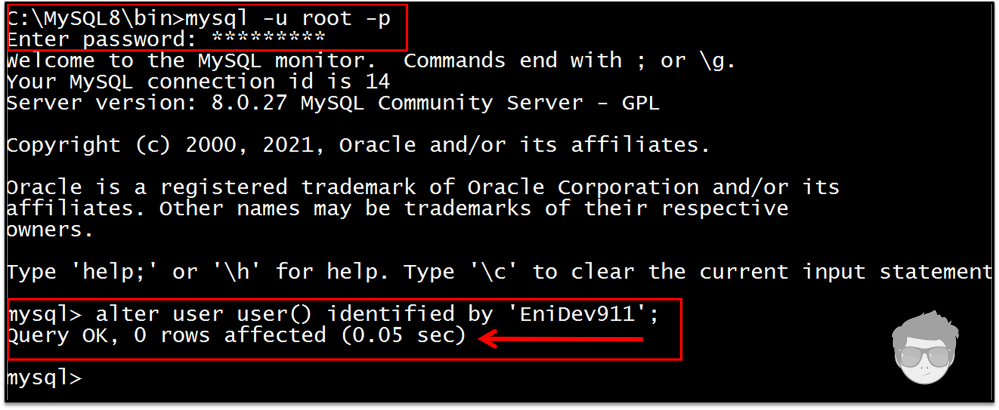
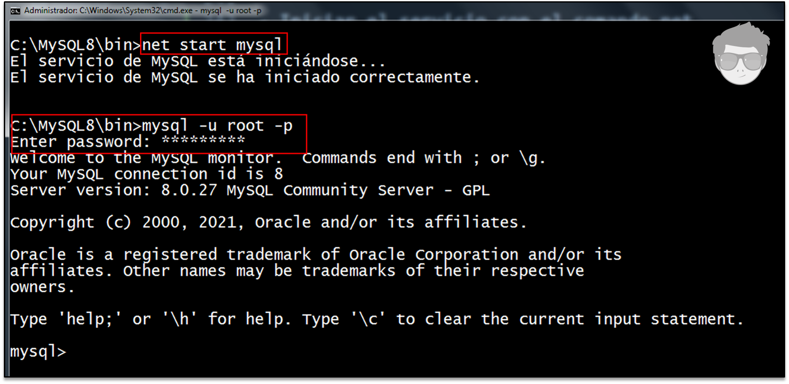

## DESCARGAR ARCHIVOS

Ingresa a la [página de descargar](https://dev.mysql.com/downloads/file/?id=509736){:target='_blank' class='link'}, ya esta seleccionado el archivo, solo damos clic en donde está señalado en la siguiente ilustración y comenzará la descarga:



Extraemos el contenido en el destino deseado:


---

## ARCHIVO DE OPCIONES

El archivo de opciones es el archivo que define la configuración que se utilizará para iniciar el servidor de MySQL. Si es necesario especificarle opciones al servidor durante su inicio, esto también se puede hacerse desde la línea de comandos pero es conveniente colocarlas en un archivo.

Esto es especialmente necesario en las siguientes circuntancias:

1. El directorio de instalación o de datos son diferentes de los usados por defecto. Por ejemplo:
	- 📁 C:\Program Files\MySQL\MySQL Server 8.x
	- 📁 C:\Program Files\MySQL\MySQL Server 8.x\data
2. Es necesario afinar la configuración del servidor.

Los parámetros declarados en este archivo de opciones son leídos cada vez que iniciamos o reiniciamos el servidor MySQL. El archivo dentro tiene una sección o directiva exclusiva para el servidor llamada `[mysqld]` donde se puede definir la siguiente información:

- `basedir`: el directorio raíz de la instalación.
- `datadir`: la ubicación del directorio de datos (se crea por defecto dentro del directorio base de instalación en un subdirectorio llamado **data**).

---

## CREAR Y EDITAR UN ARCHIVO DE OPCIONES

Un archivo de opciones puede crearse y modificarse con cualquier editor de texto, como el bloc de notas lo importante es guardar el archivo con el nombre **my.ini** en el directorio raíz de instalación.

La modificación de este archivo conlleva el actualizar las configuraciones del servidor al iniciarse, por lo que cada vez que realicemos cambios en este archivo debemos detener el servidor e iniciarlo nuevamente una vez salvado los cambios.

En la raíz de donde se descomprimieron los archivos, creamos un nuevo archivo de opciones:

{:target='_blank' class='link'}

A continuación puedes ver algunas opciones recomendadas para definirlas en base a sus necesidades:

{: .clipboard }
```ini
[client]
port=3306

[mysqld]
basedir=C:/MySQL8
datadir=C:/data
port=3306
key_buffer_size=16M
max_allowed_packet=8M

[mysqldump]
quick=True
```

---

## INICIALIZAR EL SERVIDOR

Si vemos dentro del paquete ZIP no incluye un directorio **data**. Para inicializar un servidor MySQL, en caso que exista un archivo de opciones, se creará un directorio **data** dentro del directorio de instalación y dentro de ese directorio se crearan las bases de datos del sistema llenando las tablas de la base de datos mysql.

Usando el siguiente comando se puede inicializar el servidor:

{: .clipboard }
```bash
mysqld --initialize
```

Este comando realiza lo siguiente:

- Inicializa el directorio de datos de MySQL y crea las tablas del sistema.
- Instala el esquema [`sys`](https://dev.mysql.com/doc/refman/8.0/en/sys-schema.html){:target='_blank' class='link'}.
- Crea una cuenta administrativa.

Implementación segura por defecto:

- Se crea una sola cuenta administrativa `root@localhost` con una contraseña generada aleatoriamente, que se marca como caducada.
- No se crean cuentas de usuario anónimo.
- No se crea ninguna base de datos como **test** accesible para todos los usuarios.
- La opción `--random-password-file` está disponible para controlar dónde se escribe la contraseña aleatoria.

---

## AGREGAR AL PATH

Para ejecutar después el programa cliente de mysql desde cualquier ubicación, debemos incluir el directorio `mysql8\bin` a la variable **PATH**:



También se puede hacer a través de un **CMD** normal (para que sea disponible a nivel de usuario) o como administrador (para que sea disponible a nivel de sistema):

{: .clipboard }
```plaintext
setx PATH "%path%;"C:\MySQL8\bin\
```

---

## PRIMERA CONEXIÓN

Independiente de la configuración que hemos dado para conectarse al servidor, primero que nada debemos inicializarlo, y luego conectarnos como clientes, dentro de la carpeta **data** se encuentra un archivo llamado `nombre_equipo.err` abrimos ese archivo con bloc de nota y buscamos el password generado para el usuario root de manera temporal:


---

## ESTABLECER UNA NUEVA CONTRASEÑA

Por medio del comando `ALTER USER` podemos modificar las cuentas de usuario de MySQL. Permite modificar las propiedades de autenticación y administración de contraseña para las cuentas existentes.

Para cada cuenta afectada, `ALTER USER` modifica la fila correspondiente en la tabla `mysql.user`. Las propiedades no especificadas conservan su valor actual:

{: .clipboard }
```sql
ALTER USER USER() IDENTIFIED BY 'proPassword123';
```

Estamos usando la función `user()` para referirnos a nuestra propia cuenta sin nombrar literalmente la cuenta. A continuación vamos a ver una ilustración aplicando el cambio de password al usuario `root@localhost` con el que accedemos con la password generada temporalmente por el servidor al momento de su primera iniciación:



---

## CONFIGURAR MYSQL COMO SERVICIO

Nos posicionamos dentro del directorio de instalación e ingresamos a la carpeta **bin** y ejecutamos los siguientes comandos. Para llevar a cabo estos pasos es necesario **abrir la sesión de CMD con privilegios de administrador**.

El siguiente es comando es para asegurarte de no tener ninguna instancia del servidor corriendo actualmente:

{: .clipboard }
```bash
mysqladmin -u root shutdown
```

El siguiente comando registra MySQL como servicio:

{: .clipboard }
```bash
mysqld --install "MySQL8"
```

Ahora ya podemos iniciar el servicio o detenerlo desde la línea de comandos, abrir una nueva CMD como administrador.

Iniciar el servicio con el comando net:

{: .clipboard }
```bat
net start MySQL8
```

Detener el servicio:

{: .clipboard }
```bat
net stop MySQL8
```



Eliminar el servicio:

{: .clipboard }
```bat
sc delete MySQL8
```