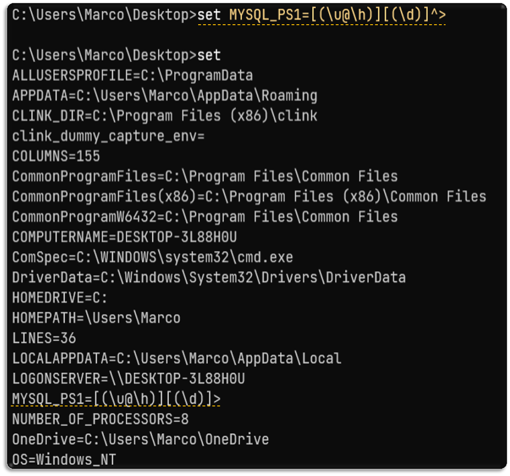
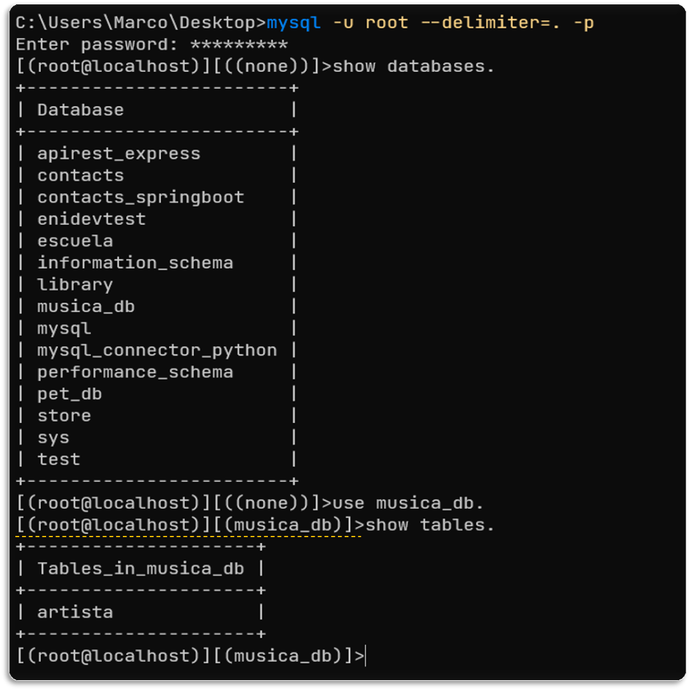
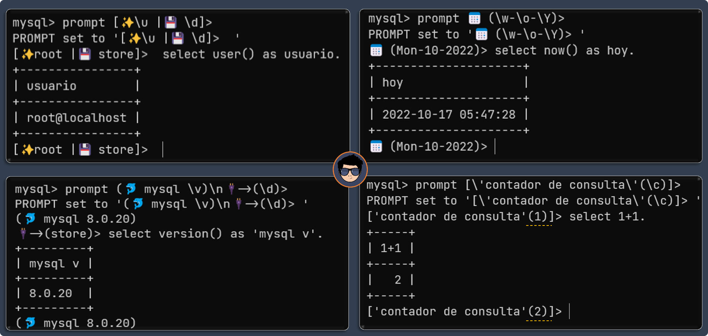
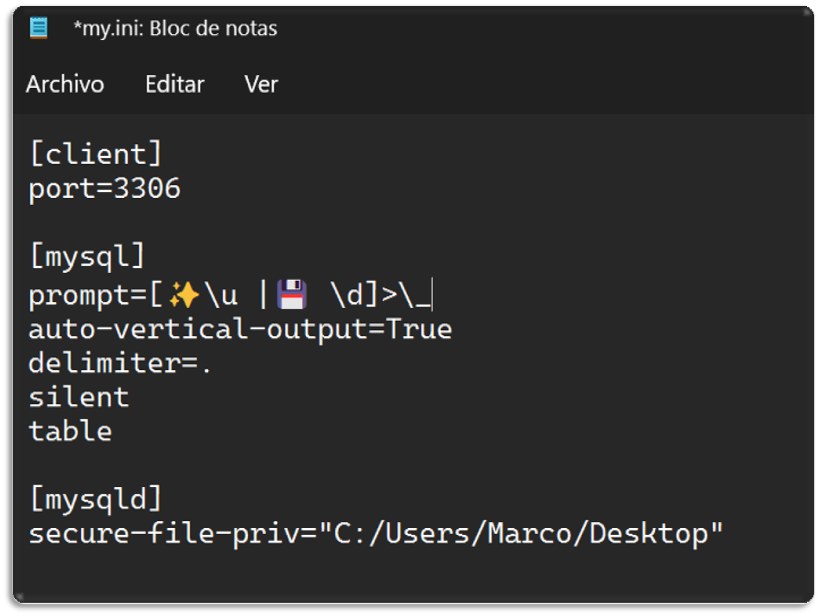

[comment]: <> (Author: Marco Contreras Herrera)
[comment]: <> (Email: enidev911@gmail.com)

## Contenido

- [¿Que es el prompt?](#que-es)
- [Cambiar el prompt desde la sesión interactiva](#cambiar-desde-sesion)
- [Cambiar el prompt desde archivo de opciones](#personalizar-desde-archivo)

## ¿Qué es el prompt?

Visualmente es el conjunto de caracteres que se muestra en la línea de comandos para indicar que está a la espera de órdenes. En todos los intérpretes de comandos esto suele variar y a su vez suele configurar para dar información de interés.

El **prompt** del programa cliente **mysql** se suele personalizar para ofrecer cierta información a simple vista. Lo podemos personalizar mediante la variable de entorno **MYSQL_PS1** o con el comando **`prompt`** dentro de la sesión interactiva. 

Por ejemplo, mediante la variable **MYSQL_PS1** 

**Windows-CMD**:  

{: .clipboard }

set MYSQL_PS1=[(\u@\h)][(\d)]^> 


**Linux-bash**:

{: .clipboard }

MYSQL_PS1='[(\u@\h)][(\d)]>' 


indicamos al cliente de mysql que queremos que nos muestre el usuario con el que estamos conectado, el host al que se conecta y la base de datos. Algunas opciones de información son:

- **\\U** : nombre del usuario conectado y host (Ej: root@localhost)
- **\\u** : nombre del usuario conectado (Ej: root)
- **\\h** : nombre del host (Ej: localhost)
- **\\d** : nombre de la base de datos en uso (Ej: test)
- **\\D** : Fecha y hora actual (Ej: Sun Jan 30 13:38:52 2022)

Ejemplo en el símbolo de sistema de Windows

{: height="450"}

Como resultados obtendremos lo siguiente cuando nos conectemos:  

{: height="450" }

>**Nota**: Al establecer el valor de la variable mediante el comando **`set`** solo estará disponible en esa sesión o instancia de la ventana de CMD.  

Si queremos establecer el valor a la variable de forma permanente en Windows lo hacemos por medio del comando **setx**:  

{: .clipboard }

setx MYSQL_PS1 "[(\u@\h)][(\d)]> "


---

## Personalizar dentro del cliente mysql

Una vez dentro de la sesión interactiva podemos cambiar el prompt usando el comando **prompt** o el método abreviado **\R**.  

{: .clipboard }

prompt [✨\u |💾 \d]> 


{: .clipboard }

prompt 📅 (\w-\o-\Y)> 


{: .clipboard }

prompt (🐬 mysql \v)\n🔌->(\d)>


{: .clipboard }

prompt [\'contador de consulta\'(\c)]>


---

## Personalizar el prompt desde el archivo de configuración de MySQL/MariaDB

Editamos el archivo de opciones de MySQL/MariaDB

**En Linux** 

Modifique el path según su instalación:

{: .clipboard }

sudo nano /etc/mysql/my.cnf


**Windows**

Modifique el path según su instalación:

{: .clipboard }

notepad.exe C:\MySQL_8\my.ini


Buscamos la sección mysql y añadimos lo siguiente:  

{: .clipboard }

[mysql]
prompt=[✨\u |💾 \d]>\_


