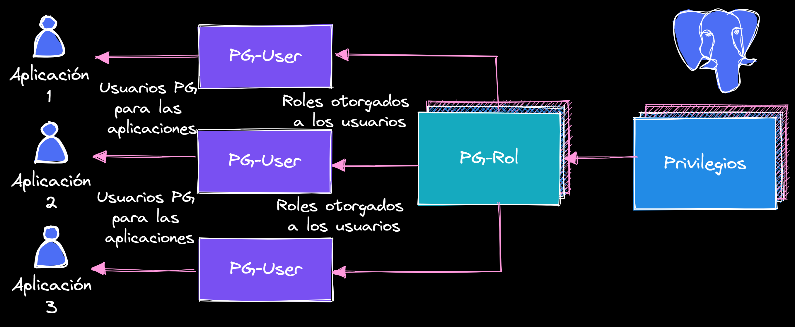
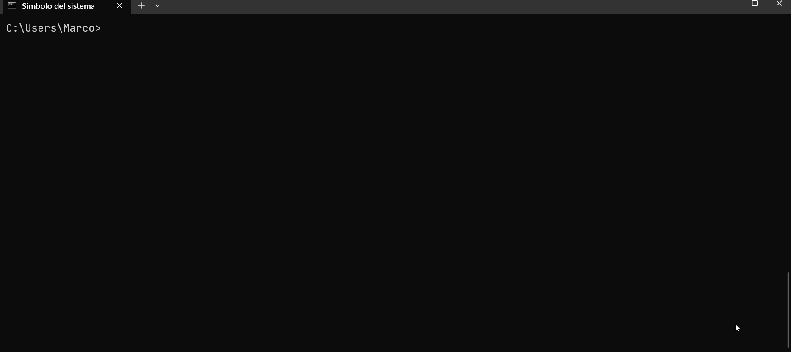
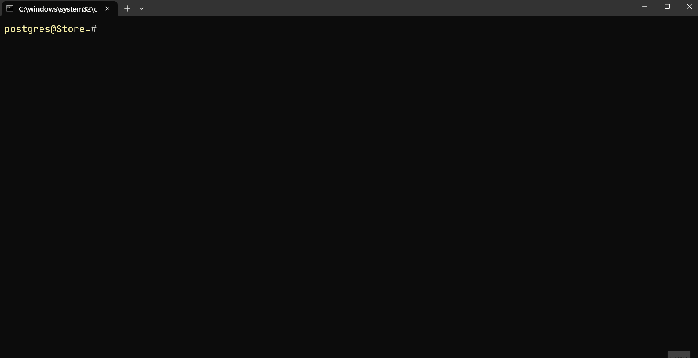
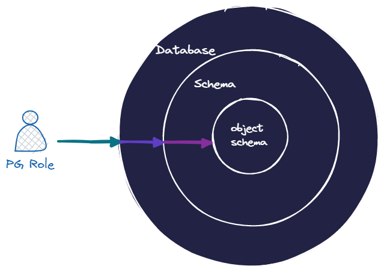
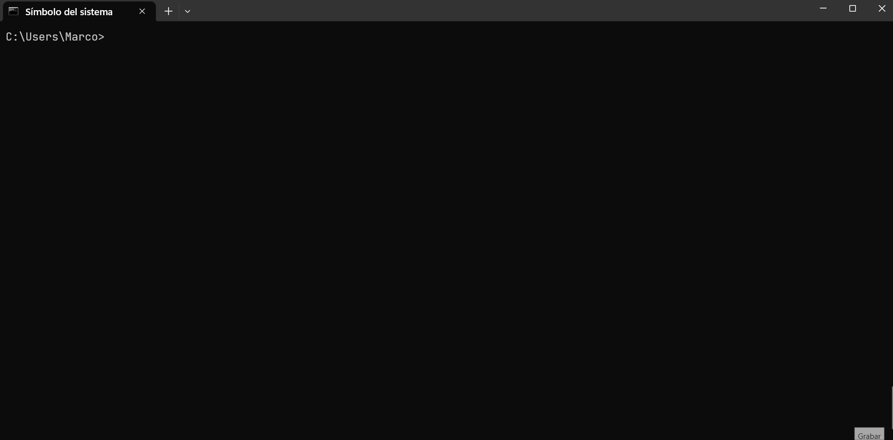

[](../)


## CONTENIDO

- [Introducción](#intro)
- [Crear roles y usuarios](#create-role)
- [Esquema public](#schema-public)
- [Privilegios](#privilegios)
- [Eliminar roles](#eliminar-roles)

<a name="intro"></a>
## Introducción


Con PostgreSQL, podemos crear usuarios y roles con permisos de acceso granulares. Al nuevo usuario o rol se les debe conceder selectivamente los permisos necesarios para cada objeto de base de datos. Esto da mucho poder al usuario final, pero al mismo tiempo, dificulta potencialmente el proceso de creación de usuarios y roles con los permisos correctos.  

PostgreSQL nos permite conceder permisos directamente a los usuarios de la base de datos. Sin embargo, como práctica recomendada, se puede crear varios roles con conjuntos específicos de permisos basados en los requisitos de una aplicación y acceso. Paso seguido, se le asigna el rol apropiado a cada usuario. Los roles deben utilizarse para aplicar un modelo de privilegios mínimos para acceder a objetos de base de datos. El usuario maestro o superusuario que se crea durante la instalación de PostgreSQL solo debe utilizarse para tareas de administración de bases de datos, como la creación de otros usuarios, roles y bases de datos. **El usuario maestro nunca debe ser utilizado por la aplicación**.



---

## CREAR ROLES Y USUARIOS

En PostreSQL no existen los usuarios y los grupos como tal, sino que
tenemos roles. Cada instalación de PostgreSQL nos brinda una
aplicación para crear roles, el cuál se puede usar por invocando el
nombre del programa <a href="https://www.postgresql.org/docs/current/app-createuser.html" class="link" target="_blank"><code class="language-plaintext">createuser</code></a> que es un wrapper que crea un **ROLE** con permisos de conexión.

Para poder crear un usuario - role **es necesario tener permisos de super usuario** o al menos el privilegio de `CREATROLE`.


Para ver los roles existentes:  

```sql
SELECT rolname from pg_roles;
```

```txt
-[ RECORD 5 ]--+--------------------------
rolname        | bobafett
rolsuper       | f
rolinherit     | t
rolcreaterole  | f
rolcreatedb    | f
rolcanlogin    | t
rolreplication | f
rolconnlimit   | -1
rolpassword    | ********
rolvaliduntil  |
rolbypassrls   | f
rolconfig      |
oid            | 32768
-[ RECORD 6 ]--+--------------------------
```

<a name="create-role"></a>
### CREATE ROLE

```text
CREATE ROLE name [ [ WITH ] option [ ... ] ]

donde option puede ser:

      SUPERUSER | NOSUPERUSER
    | CREATEDB | NOCREATEDB
    | CREATEROLE | NOCREATEROLE
    | INHERIT | NOINHERIT
    | LOGIN | NOLOGIN
    | REPLICATION | NOREPLICATION
    | BYPASSRLS | NOBYPASSRLS
    | CONNECTION LIMIT connlimit
    | [ ENCRYPTED ] PASSWORD 'password' | PASSWORD NULL
    | VALID UNTIL 'timestamp'
    | IN ROLE role_name [, ...]
    | IN GROUP role_name [, ...]
    | ROLE role_name [, ...]
    | ADMIN role_name [, ...]
    | USER role_name [, ...]
    | SYSID uid

```

`CREATE ROLE` agrega un nuevo rol a un clúster de base de datos. Un rol es una entidad que puede poseer objetos de base de datos y tener privilegios de bases de datos; un rol puede considerarse un "**usuario**", un "**grupo**" o ambos según como se utilice.


#### Ejemplos:

Crear un rol que puede iniciar sesión, pero no le asignamos contraseña:

```sql
CREATE ROLE boba_fett LOGIN;
```

Asignandole una contraseña a el usuario boba_fett desde la sesión interactiva de psql con el meta-comando `\password`:  

```text
\password boba_fett
```

<details>
  <summary>Clic ver ejemplo en psql</summary>
  
</details><br>

Crear un rol con una contraseña:  

```sql
CREATE USER dart_vader WITH PASSWORD 'dark_side123';
```

Los usuarios, grupos y roles son lo mismo en PostgreSQL, y la única diferencia es que los usuarios tienen permiso para iniciar sesión de forma predeterminada. Las instrucciones `CREATE USER` y `CREATE GROUP` son en realidad **alias** de la instrucción `CREATE ROLE`.

La siguiente instrucción SQL:

```sql
CREATE USER myuser WITH PASSWORD 'secret_passwd';
```
Es lo mismo que la siguiente instrucción SQL:

```sql
CREATE ROLE myuser WITH LOGIN PASSWORD 'secret_passwd';
```

<details>
  <summary>Clic para ver ejemplo 🖱️</summary>
  
</details><br>

Ambas sentencias crean exactamente lo mismo, un usuario. Este nuevo usuario no tiene ningún permiso aparte de los permisos predeterminados disponibles para el **rol public**. Todos los nuevos usuarios y roles heredan los permisos del **rol public**.

[](#top)

---

<a name="schema-public"></a>
### Esquema public y rol public

Cuando se crea una nueva base de datos, PostgreSQL crea de forma predeterminada un esquema denominado **public** y concede acceso en este esquema a un rol de backend denominado **public**. A todos los usuarios y roles nuevos se les concede de forma predeterminada el **rol public** y, por lo tanto, pueden crear objetos en el esquema **public**.

PostgreSQL utiliza el concepto de [rutas de búsqueda](https://www.postgresql.org/docs/current/ddl-schemas.html#DDL-SCHEMAS-PATH). La ruta de búsqueda es una lista de nombres de esquema que PostgreSQL comprueba cuando no se utiliza un nombre calificado del objeto de bases de datos.  Por ejemplo, cuando selecciona de una tabla denominada “`mytable`”, PostgreSQL busca esta tabla en los esquemas enumerados en la ruta de búsqueda. Elige la primera coincidencia que encuentra. De forma predeterminada, la ruta de búsqueda contiene los siguientes esquemas:

```sql
show search_path;
```


El nombre de "**$user**" se refiere al nombre del usuario que ha iniciado sesión actualmente. De forma predeterminada, no existe ningún esquema con el mismo nombre de usuario. Por lo tanto, el esquema **public** se convierte en el esquema predeterminado siempre que se utiliza un nombre de objeto no calificado. Por este motivo, cuando un usuario intenta crear una nueva tabla sin especificar el nombre del esquema, la tabla se crea en el esquema **public**. Como se mencionó anteriormente, de forma predeterminada, todos los usuarios tienen acceso para crear objetos en el esquema **public** y, por lo tanto, la tabla se ha creado correctamente.

Esto se convierte en un problema si inteta crear un usuario de solo lectura. Incluso si restringe todos los privilegios, los permisos heredados a través del **rol public** permiten al usuario crear objetos en el esquema **public**.  

Para solucionarlo, se debe revocar el permiso de creación predeterminado en el esquema **public** desde el **rol public** mediante la siguiente instrucción SQL:  

```sql
REVOKE CREATE ON SCHEMA public FROM PUBLIC;
```

La siguiente declaración revoca la capacidad del **rol público** de conectarse a la base de datos:  

```sql
REVOKE ALL ON DATABASE mydb FROM PUBLIC;
```

Esto garantiza que los usuarios no puedan conectarse a la base de datos de forma predeterminada a menos que se conceda explícitamente este permiso.

La revocación de los permisos del **rol public** afecta a todos los usuarios y roles existentes. Los usuarios y roles que deberían de poder conectarse a la base de datos o crear objetos en el esquema público deben recibir los permisos explícitamente antes de revocar los permisos del rol **public** en el entorno de producción.  

[](#top)

---

<a name="privilegios"></a>
### Asignación de permisos

En esta sección se documenta el proceso de creación de nuevos roles y el proceso de concesión de permisos para acceder a varios objetos de datos. Los permisos deben concederse a nivel de base de datos, esquema y objeto de esquema. Por ejemplo, si necesita conceder el acceso a una tabla, también debe asegurarse de que el rol tenga acceso a la base de datos y al esquema en que existe la tabla. Si falta alguno de los permisos, el rol no puede acceder a la tabla.

<p align="center">
  
</p>

El nombre sigue las reglas para los identificadores de SQL: sin adornor ni caracteres especiales o entre comillas dobles.

#### Ejemplos

**Crear un rol de solo lectura**  

El primer paso consiste en crear un nuevo rol denominado **readonly** mediante la siguiente instrucción SQL:

```sql
CREATE ROLE readonly;
```

Este es un rol simple sin permisos ni contraseña. No se puede utilizar para iniciar sesión en la base de datos.

Conceda permiso a este rol para conectarse a la base de datos de destino denominada “`demodatabase`”:

```sql
GRANT CONNECT ON DATABASE demodatabase TO readonly;
```

El siguiente paso es otorgar acceso al uso de este rol a su esquema. Supongamos que el esquema se llama `schemademo`:

```sql
GRANT USAGE ON SCHEMA schemademo TO readonly;
```

Para determinar el conjunto de roles existentes, examine el catálogo del sistema consultando la vista `pg_roles`, por ejemplo:  

```sql
SELECT rolname FROM pg_roles;
```

Asignamos el rol de readonly a un usuario\|rol existente:  

```sql
GRANT readonly TO rolname;
```

Para mayor comodidad, los programas `createuser` y `dropuser` se proporcionan como contenedores de estos comandos SQL que se pueden llamar desde la línea de comandos del shell:  

<details>
  <summary>Clic para ver ejemplo desde psql 🖱️</summary>
  
</details><br>


---

### ¿Por qué no puedo eliminar un usuario o rol en mi instancia de base de datos para PostgreSQL?

**Descripción corta**  

Cuando un usuario o rol en PostgreSQL crea un objeto, como una tabla o un esquema, el usuario o rol es el propietario del objeto creado. Si intenta eliminar un usuario o rol que posee uno o más objetos en cualquier base de datos o tiene privilegios respecto a estos objetos, recibirá un error que indica que hay objetos que dependen de del usuario o rol junto con los permisos concedidos, si los hay.

Para eliminar un usuario o rol que tiene objetos dependientes, debe hacer lo siguiente:

1. Reasignar la propiedad de estos objetos a otro usuario.
2. Revoque todos los permisos que se hayan concedido al usuario o rol.
3. Eliminar al usuario o rol

>**NOTA:** Si estos objetos ya no son necesarios, considere la posibilidad de eliminarlos y, a continuación, eliminar el rol. Puede eliminar todos los objetos que son propiedad de un rol en una base de datos mediante el comando [`DROP OWNER`](https://www.postgresql.org/docs/current/sql-drop-owned.html). También puede revocar los privilegios concedidos al rol en los objetos de esa base de datos o los objetos compartidos. Una vez que el comando **DROP OWNED** se ejecute correctamente, puede eliminar la función.

**Resolución** 

En el siguiente ejemplo, se utilizan tres roles de base de datos diferentes:

- **test_user**: este es el usuario o rol que se debe administrar
- **admin_user**: este es el rol que se usa para eliminar el usuario o rol requeridos. Este usuario es el usuario con más privilegios.
- **another_user**: este es el usuario o rol que se le asigna la propiedad de los objetos que son propiedad de test_user. 

Ejecuta el siguiente comando para ver el rol con el que se inició sesión:  

```sql
SELECT current_user;
```

Ahora intenta eliminar un usuario o rol con objetos dependientes, aparece un error similar al siguiente:  

```txt
DROP ROLE test_user;
ERROR:  role "test_user" cannot be dropped because some objects depend on it
DETAIL:  privileges for database pg_example
owner of table test_table
owner of schema test_schema
owner of sequence test_schema.test_seq
privileges for table test_t2
```

En el mensaje de error, se obtiene la siguiente información:  

- El rol **test_user** tiene privilegios concedidos en la base de datos **pg_example** y en la tabla **test_t2**.
- El rol **test_user** es propietario de la tabla **test_table**, el esquema **test_schema** y un objeto de secuencia **test_seq** en **test_schema**.

> **Nota:** 
```txt
pg_another_db=> DROP ROLE test_user;
ERROR:  role "test_user" cannot be dropped because some objects depend on it
DETAIL:  privileges for database pg_example
4 objects in database pg_example
```

Para eliminar el usuario o la función, debemos reasignar la propiedad de los objetos en propiedad a otro usuario o rol y revocar los permisos asociados. Para ello podemos utilizar el comando [`REASSIGN OWNED`](https://www.postgresql.org/docs/current/sql-reassign-owned.html) de PostgreSQL para reasignar la propiedad de estos objetos a otro usuario. Al ejecutar este comando, es posible que aparezca un error similar al siguiente:  

```text
pg_example=> select current_user;
 current_user
--------------
 test_user
pg_example=> REASSIGN OWNED BY test_user TO another_user;
ERROR:  permission denied to reassign objects
```

Para resolver este problema, debe conceder el usuario o rol al usuario que está reasignando la proppiedad. No puede ser `test_user` para hacerlo porque **`test_user`** no es el propietario **`another_user`**. Por lo tanto, es posible que aparezca un error similar al siguiente:  

```text
pg_example=> select current_user;
 current_user
--------------
 test_user
pg_example=> grant another_user to test_user;
ERROR:  must have admin option on role "another_user"
```

Puede realizar  una de las siguientes acciones para conceder al usuario o el rol al usuario que está reasignando la propiedad:  

- Iniciar sesión con el **usuario maestro** y ejecutar el comando `GRANT`

```text
pg_demodb=> select current_user;
+--------------+
| current_user |
+--------------+
| admin_user   |
+--------------+
pg_demodb=> GRANT another_user TO test_user;
GRANT ROLE
```

En este caso, se produce un error aunque el comando `REASSIGN` se haya realizado correctamente. Esto se debe a que los privilegios de **test_user** deben revocarse.