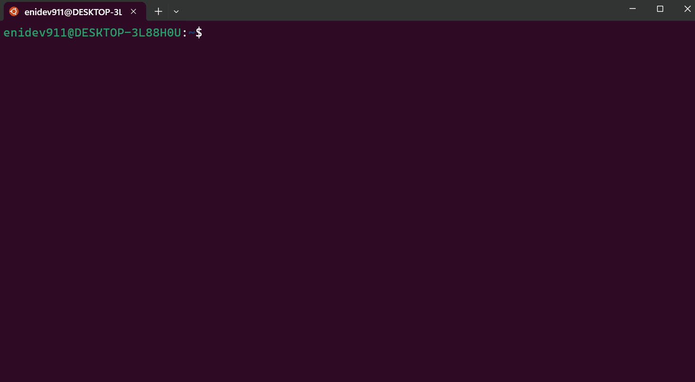
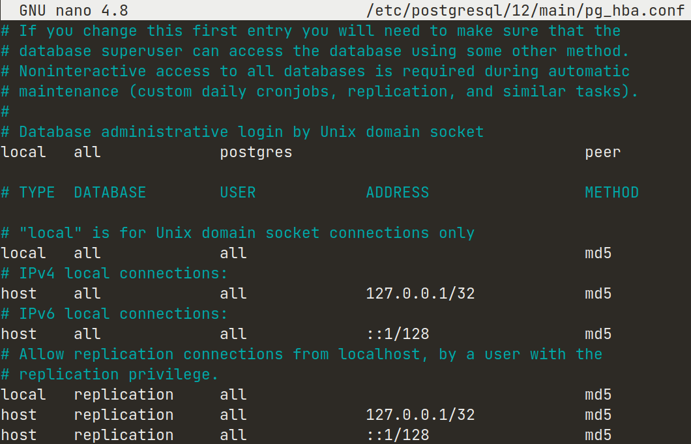

- [Cambiar a cuenta de postgres](#cambiar-a-postgres)
- [Crear un rol](#crear-un-rol)
- [Crear una nueva base de datos](#crear-nueva-basedatos)
- [Cambiar el método de autenticación a través del archivo pg_hba.conf](#cambiar-metodo-autenticacion)


Instalar los paquetes de PostgreSQL desde los repositorios predeterminados de Ubuntu. Para ello es necesario actualizar el índice de paquete:  

{: .clipboard }

sudo apt update


Luego, podemos instalar el paquete de Postgre junto al paquete **postgresql-contrib**, que agrega algunas utilidades y funcionalidades adicionales:  

{: .clipboard }

sudo apt install postgresql postgresql-contrib



Ahora que tenemos el software instalado, podemos analizar su funcionamiento. Por defecto, Postgres utiliza el concepto de **roles** para gestionar la autenticación y la autorización. Este aspecto es similar a las cuentas normales de estilo Unix, pero Postgres no distingue entre los usuarios y los grupos, y es por ello que prefiere usar el término más flexible como lo es **rol**.

Postgres se configura por defecto para usar la autenticación **ident**. Esto significa que asocia los roles de Postgres con una cuenta de sistema Unix o Linux correspondiente. 

En el proceso de instalación Postgres creó una cuenta de usuario llamada **postgres, que se asocia con el rol predeterminado de Postgres**. Para comenzar a usar Postgres, podemos iniciar sesión en esa cuenta. Existen varias maneras de usar esta cuenta para acceder a Postgres.


<a name="cambiar-a-postgres"></a>
## Cambiar a la cuenta de postgres

Primero podemos invocar un shell con con inicio de sesión usando simplemente `sudo -i -u` especificando el usuario en este caso tenemos al usuario **postgres**:

{: .clipboard }

sudo -i -u postgres


Ahora, podemos acceder al servidor de Postgres invocando al cliente de línea de comandos **psql**: 

{: .clipboard  }

psql



También se puede ejecutar el comando con la cuenta de **postgres** de forma directa a través de **sudo**:  

{: .clipboard  }

sudo -u postgres psql


Esto nos permitirá iniciar sesión de forma directa en Postgres sin el shell **bash** intermediario entre ellos.

Para salir de la sesión interactiva de postgres, ejecutamos el meta comando `\q`.

### DEMOSTRACIÓN




---


<a name="crear-un-rol"></a>
## Crear un rol

En este momento, solo tenemos el rol de **postgres** configurado dentro de la base de datos. Podemos crear nuevos roles a partir desde la línea de comandos usando la herramienta de línea de comando incluido en la instalación de postgres como por ejemplo `createuser` y le indicamos la opción `--interactive` para que nos solicite el nombre del nuevo rol y también nos preguntará si debería tener **permisos de superusuario**.


{: .clipboard }

createuser --interactive


Si, como alternativa podemos usar **sudo** para cada comando sin dejar de usar nuestra cuenta normal:  

{: .clipboard }

sudo -u postgres createuser --interactive


Podemos ver más opciones adicionales de esta herramienta **`createuser`**:

{: .clipboard }

man createuser


---


<a name="crear-nueva-basedatos"></a>
## Crear nueva base de datos

Otra susposición que el sistema de autenticación de Postgres realiza por defecto es que para cualquier rol creado para que pueda iniciar sesión deberá existir una base de datos con el mismo nombre del rol.

Esto significa que, si el usuario que desea acceder a Postgres con un rol llamado **boba-fett**, ese rol intentará conectarse con una base de datos, que por defecto, también se debe llamarse **boba-fett**. De lo contrario obtendremos un error por intentar acceder a una base de datos que no existe.

Podemos crear la base de datos apropiada usando la herramienta **`createdb`**.

{: .clipboard }

createdb boba-feet



Para iniciar sesión con la autenticación basada en *ident*, necesitaremos un usuario de Linux con el mismo nombre del rol y su base de datos de Postgres.

Podemos crear un usuario en Linux con el comando `adduser`,  Debe tener privilegios **sudo** para ejecutar el comando: 

```bash
sudo adduser boba-fett
```

Ahora nos deberá solicitar crear un password para el nuevo usuario, una vez se establece podemos iniciar sesión usando el siguiente comando:

```bash
su boba-fett
```

Nos pedirá la constraseña que establecimos anteriormente, iniciada la sesión ahora simplemente podemos invocar a **psql**:

```bash
psql
```

---

<a name="cambiar-metodo-autenticacion"></a>
## Cambiar el método de autenticación

PostgreSQL admite múltiples métodos de autenticación de clientes. En ubuntu, `peer` es el método de autenticación por defecto que se usa para conexiones locales (*local*), mientras que `scram-sha-256` (esto solía ser `md5` hasta Ubuntu 21.10) es el predeterminado para las conexiones **host** (conexiones realizadas mediante **TCP/IP**).

Como mencianamos anteriormente de forma predeterminada, solo se permiten conexiones desde el sistema local; para permitir que todas las demás computadoras se conecten al servidor de PostgreSQL, editamos el archivo `/etc/postgresql/*/main/postgresql.conf`. Localizamos la siguiente línea **#listen_addresses='localhost'** y la cambiamos por `'*'`:

{: .clipboard }

listen_addresses = '*'



> **Nota:**  
> `*` permitirá que todas las interfaces IP disponibles (IPv4 e IPv6) solo escuchen el conjunto IPv4 '0.0.0.0' mientras que `::` permite escuchar todas las direcciones IPv6.

Ahora que podemos conectarnos a nuestro servidor PostgreSQL, el siguiente paso es establecer una contraseña para el usuario de **Postgres**. Ejecute el siguiente comando en la terminal para conectarse a la base de datos predeterminada:

{: .clipboard }

sudo -u postgres psql template1


El comando anterior se conecta a la base de datos `template1` con el usuario `postgres`. Una vez se conecta al servidor PostgreSQL, aparecerá un mensaje en el prompt que nos solicita cambiar el password. Podemos ejecutar el siguiente comando SQL para establecer la contraseña para el usuario `postgres`:

{: .clipboard }

ALTER USER postgres with encrypted password 'my_password';






---


<small>¿Quieres apoyarme? 👇</small>

&nbsp;&nbsp;&nbsp;&nbsp;[](https://www.buymeacoffee.com/9111592) 