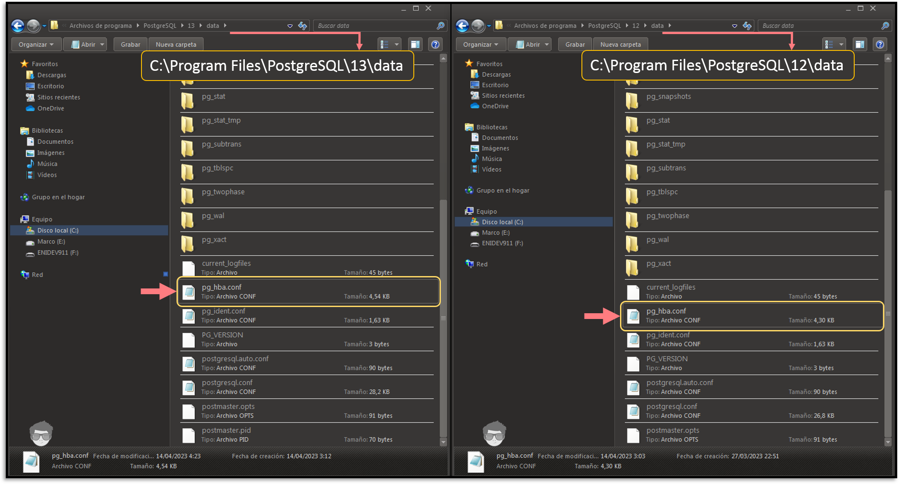
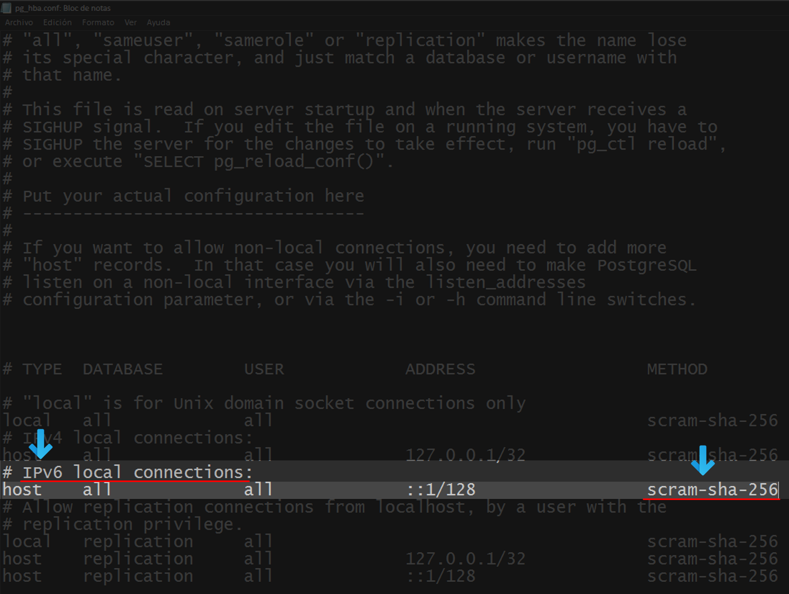
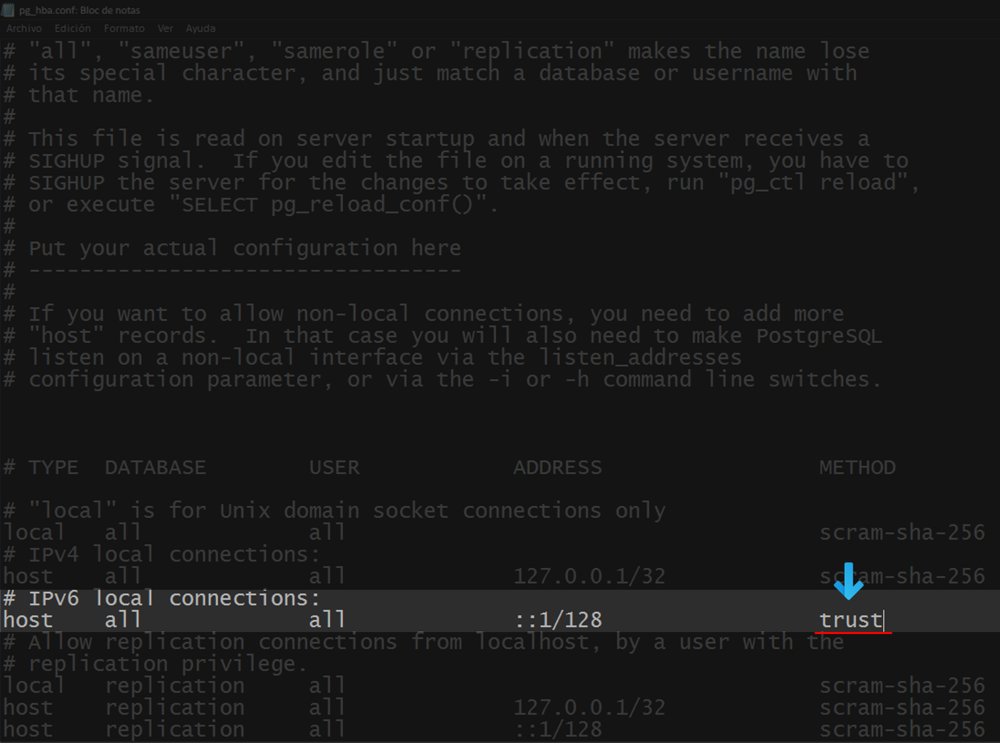
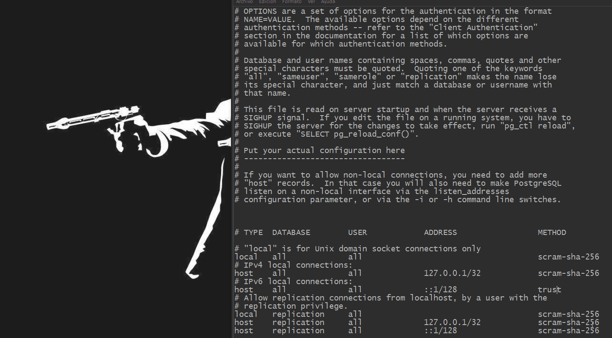

[comment]: <> (Author: Marco Contreras Herrera)
[comment]: <> (Email: enidev911@gmail.com)

## Resumen

- [¿Qué vamos hacer?](#que-hacer)
- [Cambiando el password](#cambiado-password)

 
De una vez te advierto que a pesar de que esta solución es una de las más fáciles que podemos realizar no recomiendo dejar este método como un *bypass* definitivo sino, que más bien una llave de emergencia para que nos permita cambiar el password de nuestro superusuario administrador **postgres** y concluido el cambio, volver a dejar la configuración como estaba.

Lo cierto es que muchas veces olvidamos la contraseña de nuestro usuario administrador por defecto postgres y si estamos en un entorno local o de desarrollo lo podemos hacer sin ningún problema. Aquí asumo que estas usando alguna distribución de Linux pero si usas windows la idea es la misma sólo que cambia la ubicación de los archivos que vamos a trabajar, también asumo que tienes instalada alguna versión actualizada de postgresql, pero este método es efectivo desde versiones v12.x o superior, a partir de aquí en los comandos donde vean la “x” van a colocar el número de la versión que corresponde; ya con todo esto aclarado vamos a entrar en materia.

## ¿Qué vamos hacer?

La idea es permitir el acceso sin necesidad de contraseña al servicio de postgres únicamente para conexiones locales, para eso necesitamos **editar el archivo de configuración de conexiones hacia el servicio de base de datos `pg_hba.conf`**.

Ubicación del archivo **`pg_hba.conf`**

**Linux**: 

- En centos lo ubicas en `/var/lib/pgsql/version.x/data/`
- En debian y ubuntu por lo general está en `/etc/postgresql/version.x/main`

**Windows**

- `C:\Program Files\PostgreSQL\version.x\data`

> **NOTA**: version.x sera remplazado por la versión de la instalación correspondiente

Veamos dos casos de donde encontrar el archivo **`pg_hba.conf`** según tu versión de postgres instalada:

> **CONSEJO**: Te recomiendo antes de editarlo hacer un respaldo a través de un comando de la siguiente manera: `pg_hba.conf => pg_hba.conf.backup`

Una vez identificado el archivo lo abrimos con cualquier editor, bajamos hasta el final, y vamos a buscar la siguiente línea:  

- **#IPv6 local connections**: debemos asegurarnos de que al grupo que afecta es el que señala el comentario, en este caso a todas las conecciones locales con IPv6

- **scram-sha-256**: es el método de autenticación, en este caso basado en el algoritmo que señala, es posible que en vez de este valor, puede que veas  **md5** si es que estás en una versión de postgres anterior a la 12.

Ya ahora lo único que resta es cambiar el valor del método de autenticación a **trustW**:

## Cambiando el password

Una vez cambiado el método de autenticación, nos conectamos de la siguiente manera desde **psql**: 

{: .clipboard }

psql -U postgres


Una vez conectado lo único que debemos hacer, es usar el metacomando **`\password`** y cambiarle el password al usuario administrador conectado **postgres**:  

{: .clipboard }

\password postgres


