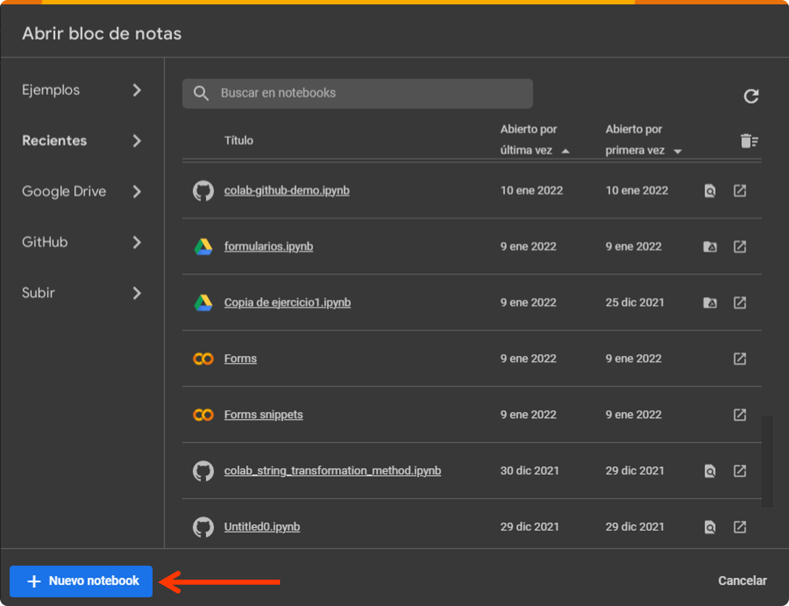

**Colab** (abreviatura de Collaboratory) es la plataforma gratuita de Google que permite a los usuarios codificar en Python. Es un servicio en la nube basado en Jupyter Notebook, proporcionando por Google. Esta plataforma nos permite entrenar los modelos de Machine Learning directamente en la nube y todo de forma gratuita. Google Colab hace lo mismo que Jupyter Notebook y un poco más, es decir, puede usar GPU y TPU de forma gratuita. Alguna de las ventajas de Google Colab incluyen la instalación rápida y el uso compartido en tiempo real de Notebook entre usuarios. Sin embargo, cargar un archivo **CSV** requiere escribir algunas líneas adicionales de códigos. En esta guía, analizaremos tres formas diferentes de cargar un archivo CSV y almacenarlo en un marco de datos de **pandas**. Para comenzar, iniciamos sesión en nuestra cuenta de Google y vamos a [`https://colab.research.google.com`](https://colab.research.google.com){:target='_blank' class='link'} luego abrimos un nuevo Notebook:


{:class='center'}

---

## Cargar desde la unidad local

Para cargar el archivo desde nuestro disco, debemos anticipar el siguiente código en la primera celda y lo ejecutamos:

{: .clipboard }
```py
from google.colab import files

uploaded = files.upload()
```

Al ejecutarlo se nos habilitará el botón para cargar el archivo como se muestra a continuación:


Luego de seleccionar el archivo CSV del disco local, en un segundo bloque escriba el siguiente fragmento de código para importarlo en un marco de datos de pandas:

{: .clipboard }
```py
import pandas as pd
import io
 
df = pd.read_csv(io.BytesIO(uploaded['file.csv']))
print(df)
```

---

## Desde Github

Es la forma más fácil de cargar un archivo CSV en Colab. Para esto, nos dirigimos al repositorio de Github y luego le hacemos clic en *Ver sin procesar*. Copiamos el enlace al conjunto de datos sin procesar y lo pasamos como parámetro a `read_csv()` en pandas para obtener el marco de datos:

{: .clipboard }
```py
import pandas as pd

url = 'copied_raw_github_link'
df = pd.read_csv(url)
```