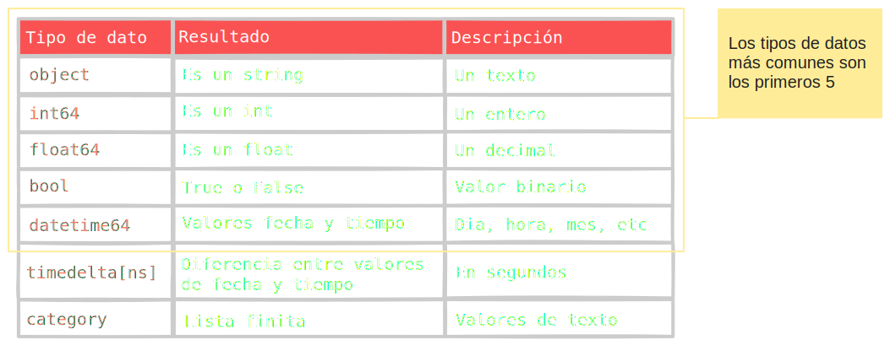

{: .clipboard .compiler.python }
```py
import pandas as pd
data = [["Felipe",24,"Masculino",4.5],["Andrea",21,"Femenino",7.0],
["Tomás",22,"Masculino",6.1],["Roberto",20,"Masculino",5.5]]
df = pd.DataFrame(data,columns = ["Nombre","Edad","Género","Calificación"])
print(df)
```

> Usamos `columns` e ingresamos una lista con los nombres de las columnas. El primer nombre de la columna que anotamos en la lista se posiciona al comienzo de la primera columna y así sucesuvamente.


---

## Cargar un archivo CSV como un Data Frame


```py
import pandas as pd
df = pd.read_csv("clientes.csv",encoding="latin-1",sep=";")
print(df)
```


## Como renombrar una columna

### Función rename

Si tenemos un Data Frame de nombre **df**, podemos cambiar el nombre de las columnas usando la siguiente sintaxis:

```py
df.rename(columns={"nombre_antiguo_columna":"nombre_nuevo_columna"})
```

Veamos un ejemplo de ello:



---


## Tipos de datos



## Cambiar tipo a una columna

### Función astype

<p style="border-radius: 3px;background-color: #131313; padding: 3px; box-shadow: 3px 3px 15px #00000050">Al cargar un archivo CSV, puede que los datos no se carguen correctamente. Por ejemplo, podría ocurrir que una columna que tiene decimales se cargue como texto. Es decir, la columna es de tipo <code class="language-plaintext">object</code>, y nos gustaría que pasará a ser de tipo <code class="language-plaintext">float64</code>.</p>

Para cambiar el tipo de dato de una columna debemos usar la siguiente sintaxis:


```py
df= df[nombre columna].astype(tipo de dato al que se quiere cambiar el tipo de la columna)
```

```py
print(df_clientes.dtypes)
df_clientes["PUNTAJE_CREDITICIO"] = df_clientes["PUNTAJE_CREDITICIO"].astype("float64")
print(df_clientes.dtypes)
```

## Función shape

