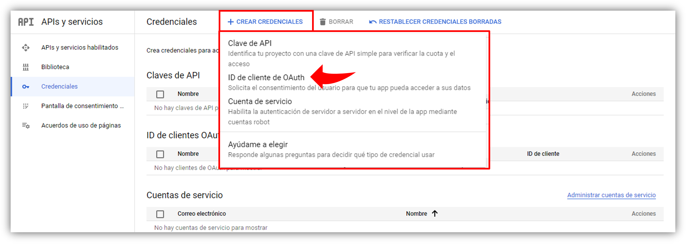
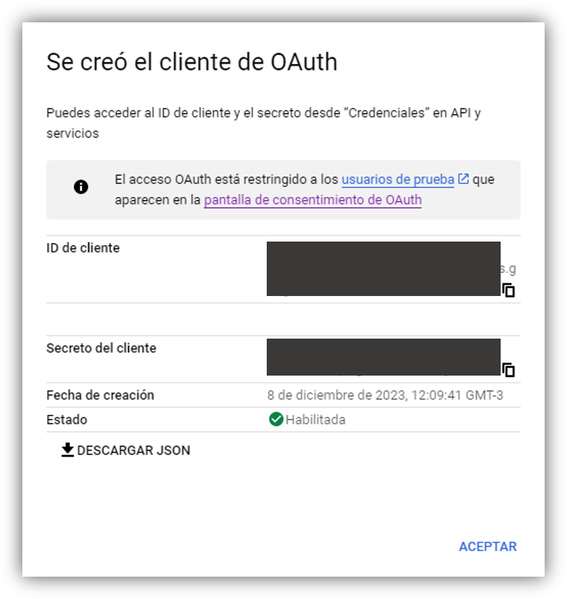

## Habilitar la API

Antes de usar cualquier APIs de Google, se debe activar en un [proyecto de Google Cloud](https://cloud.google.com/resource-manager/docs/creating-managing-projects?hl=es-419){:target='_blank' class='link'}. Podemos activar una o más APIs en un solo proyecto de Google Cloud. Lo primero es ir a la consola de Google Cloud y habilitar la API de Calendario:

<button class="btn" onclick="{window.open('https://console.cloud.google.com/flows/enableapi?apiid=calendar-json.googleapis.com&hl=es-419', '')}">Habilitar API</button>

## Configurar la pantalla de consentimiento OAuth

Si usas un proyecto de Google Cloud, necesitamos configurar la pantalla de consentimiento de OAuth y debemos agregarnos como usuario de prueba

<button class="btn" onclick="{window.open('https://console.cloud.google.com/apis/credentials/consent?hl=es-419', '')}">Ir a la pantalla de consentimiento de OAuth</button>

Luego debemos seleccionar el tipo de usuario para la app. Si usamos la cuenta normal de Gmail (no de una organización), en ese caso seleccionamos **Externo** como tipo de usuario y luego click sobre el botón **Crear**.

En la siguiente ventana, debemos completar el formulario de registro de la app y, clic en **Guardar y continuar**.

> Mientras el estado de publicación sea **Prueba**, solo los usuarios de prueba podrán acceder a la app.

## Autorizar credenciales para una aplicación web

Para autenticarte como usuario final y acceder a los datos del usuario en la app, debes crear por lo menos un ID de cliente de OAuth 2.0. Un ID de cliente se usa con el fin de identificar una sola app para los servidores de OAuth de Google. Desde la consola de Google Cloud, vamos a menú **APIS y servicios > credenciales**.

<button class="btn" onclick="{window.open('https://console.cloud.google.com/apis/credentials?hl=es-419', '')}">Ir a credenciales</button>

Damos clic en **Crear credenciales** > **ID de cliente de OAuth**:

{:align='center'}



Damos clic en **Tipo de aplicación** > **Aplicación web**. Escribe un nombre para la credencial, este nombre solo se muestra en la consola de Google Cloud.

En el apartado de **Origenes autorizados de Javascript** se agregan las URI autorizadas relacionadas con tu app.

Damos clic en **Crear**. Aparecerá la pantalla de creación del cliente de OAuth, en la que se mostrará el nuevo **ID de cliente** y el secreto del cliente.

> Los secretos del cliente no se usan en aplicaciones web

{:align='center'}
{:width="500"}

## Crear una clave de API

Vamos de nuevo a la consola de Google Cloud, y buscamos en el menú **APIs y servicios** > **Credenciales**.

<button class="btn" onclick="{window.open('https://console.cloud.google.com/apis/credentials?hl=es-419', '')}">Ir a credenciales</button>

Solo dando un clic se nos mostrará la nueva clave de API.


## Primera demostración

Para probar nuestras credenciales, buscamos una carpeta de trabajo y creamos un archivo **index.html**.

En el archivo, agremos el siguiente código:

```html
<!DOCTYPE html>
<html>
  <head>
    <title>Google Calendar API Quickstart</title>
    <meta charset="utf-8" />
  </head>
  <body>
    <p>Google Calendar API Quickstart</p>

    <!--Add buttons to initiate auth sequence and sign out-->
    <button id="authorize_button" onclick="handleAuthClick()">Authorize</button>
    <button id="signout_button" onclick="handleSignoutClick()">Sign Out</button>

    <pre id="content" style="white-space: pre-wrap;"></pre>

    <script type="text/javascript">
      /* exported gapiLoaded */
      /* exported gisLoaded */
      /* exported handleAuthClick */
      /* exported handleSignoutClick */

      // TODO(developer): Set to client ID and API key from the Developer Console
      const CLIENT_ID = '<YOUR_CLIENT_ID>';
      const API_KEY = '<YOUR_API_KEY>';

      // Discovery doc URL for APIs used by the quickstart
      const DISCOVERY_DOC = 'https://www.googleapis.com/discovery/v1/apis/calendar/v3/rest';

      // Authorization scopes required by the API; multiple scopes can be
      // included, separated by spaces.
      const SCOPES = 'https://www.googleapis.com/auth/calendar.readonly';

      let tokenClient;
      let gapiInited = false;
      let gisInited = false;

      document.getElementById('authorize_button').style.visibility = 'hidden';
      document.getElementById('signout_button').style.visibility = 'hidden';

      /**
       * Callback after api.js is loaded.
       */
      function gapiLoaded() {
        gapi.load('client', initializeGapiClient);
      }

      /**
       * Callback after the API client is loaded. Loads the
       * discovery doc to initialize the API.
       */
      async function initializeGapiClient() {
        await gapi.client.init({
          apiKey: API_KEY,
          discoveryDocs: [DISCOVERY_DOC],
        });
        gapiInited = true;
        maybeEnableButtons();
      }

      /**
       * Callback after Google Identity Services are loaded.
       */
      function gisLoaded() {
        tokenClient = google.accounts.oauth2.initTokenClient({
          client_id: CLIENT_ID,
          scope: SCOPES,
          callback: '', // defined later
        });
        gisInited = true;
        maybeEnableButtons();
      }

      /**
       * Enables user interaction after all libraries are loaded.
       */
      function maybeEnableButtons() {
        if (gapiInited && gisInited) {
          document.getElementById('authorize_button').style.visibility = 'visible';
        }
      }

      /**
       *  Sign in the user upon button click.
       */
      function handleAuthClick() {
        tokenClient.callback = async (resp) => {
          if (resp.error !== undefined) {
            throw (resp);
          }
          document.getElementById('signout_button').style.visibility = 'visible';
          document.getElementById('authorize_button').innerText = 'Refresh';
          await listUpcomingEvents();
        };

        if (gapi.client.getToken() === null) {
          // Prompt the user to select a Google Account and ask for consent to share their data
          // when establishing a new session.
          tokenClient.requestAccessToken({prompt: 'consent'});
        } else {
          // Skip display of account chooser and consent dialog for an existing session.
          tokenClient.requestAccessToken({prompt: ''});
        }
      }

      /**
       *  Sign out the user upon button click.
       */
      function handleSignoutClick() {
        const token = gapi.client.getToken();
        if (token !== null) {
          google.accounts.oauth2.revoke(token.access_token);
          gapi.client.setToken('');
          document.getElementById('content').innerText = '';
          document.getElementById('authorize_button').innerText = 'Authorize';
          document.getElementById('signout_button').style.visibility = 'hidden';
        }
      }

      /**
       * Print the summary and start datetime/date of the next ten events in
       * the authorized user's calendar. If no events are found an
       * appropriate message is printed.
       */
      async function listUpcomingEvents() {
        let response;
        try {
          const request = {
            'calendarId': 'primary',
            'timeMin': (new Date()).toISOString(),
            'showDeleted': false,
            'singleEvents': true,
            'maxResults': 10,
            'orderBy': 'startTime',
          };
          response = await gapi.client.calendar.events.list(request);
        } catch (err) {
          document.getElementById('content').innerText = err.message;
          return;
        }

        const events = response.result.items;
        if (!events || events.length == 0) {
          document.getElementById('content').innerText = 'No events found.';
          return;
        }
        // Flatten to string to display
        const output = events.reduce(
            (str, event) => `${str}${event.summary} (${event.start.dateTime || event.start.date})\n`,
            'Events:\n');
        document.getElementById('content').innerText = output;
      }
    </script>
    <script async defer src="https://apis.google.com/js/api.js" onload="gapiLoaded()"></script>
    <script async defer src="https://accounts.google.com/gsi/client" onload="gisLoaded()"></script>
  </body>
</html>
```


Bueno vamos a ir revisando lo anterior línea a línea, función por función.

En primer lugar tenemos en las primeras líneas del script lo siguiente:

```js
const CLIENT_ID = '<YOUR_CLIENT_ID>';
const API_KEY = '<YOUR_API_KEY>';
```

Simplemente estamos declarando dos constantes que almacenarán su respectivo código de **Cliente ID** y **API KEY**.

Luego tenemos 3 variables que sirven como banderas para crear un estado de carga de módulos externos:

```js
let tokenClient;
let gapiInited = false;
let gisInited = false;
```

Luego se selecciona dos elementos (los botones) y en principio permaneceran oculto, hasta que la carga de los módulos externos se complete:

```js
document.getElementById('authorize_button').style.visibility = 'hidden';
document.getElementById('signout_button').style.visibility = 'hidden';
```

Después tenemos la función `gapiLoaded()` que se invocará automáticamente despues de la carga de **api.js** y ejecutará la iniciación del cliente gapi invocando a `initializeGapiClient`:

```js
function gapiLoaded() {
  gapi.load('client', initializeGapiClient);
}
```

Ahora se define la función `initializeGapiClient`:

```js
async function initializeGapiClient(){
  await gapi.client.init({
    apikey: API_KEY,
    discoveryDocs: [DISCOVERY_DOC]
  });
  gapiInited = true;
  maybeEnableButtons();
}
```

Como se puede observar, cuando se llama a esta función asíncrona lo que hace es esperar a que se inicialice el cliente de gapi y a continuación cambiamos el estado de las variable `gapiInited` que ya teníamos definida anteriormente y se llama a la función `maybeEnableButton()` que como podemos imaginar se encargará de habilitar los botones que teníamos oculto.


## Agregar un evento

Para crear un evento, se llama al método `events.insert()` y se proporciona los siguientes parámetros:

- `calendarId` : es el identificador del calendario y puede ser la dirección de correo electrónico del calendario en el que se creará el eventoo o una palabra principal como `primary`, que hace referencia al uso del calendario principal del usuario que accedió.
- `event` : el evento que se creará con todos los detalles necesarios, como el inicio