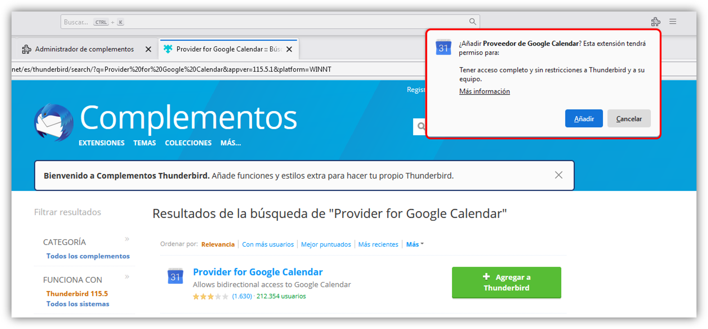

Thunderbird 115 es lo nuevo del cliente de correo electrónico de Mozilla. Esta nueva herramienta

## Lo nuevo en Thunderbird Supernova

Thunderbird ha incorporado una nueva funcionalidad que permite abrir archivos `.eml` externos en una pestaña, personalmente esto es muy grato ya que me permite ver, editar y enviar mis diseños creados para Outlook.

También se destaca que se ha **implementado una nueva barra lateral unificada** que presenta opciones frecuentes basada en la pestaña o espacio que está activo.

Una de las cosas que más destaca también en la nueva versión de Thunderbird es su interfaz de usuario donde se puede apreciar lo fresco y el sencillo aspecto que presenta, entre otras se puede destacar lo siguiente:

### Iconografía

El conjunto de gráficos vienen renovados con hermosos íconos con un estilo visual consistente con lo que representa:

{:align='center'}
{:height='480'}

### Menú de aplicaciones intuitivo

Ahora se puede acceder al menú de aplicaciones dando clic en la barra superior sobre los (≡) y su diseño ofrece una navegación más rápida e intuitiva con opciones globales persistentes combinado con una iconografía coherente.

{:align='center'}

---

## Atajos de teclado

### Nuevos mensajes

|Nuevo mensaje|(<kbd>CTRL</kbd> + <kbd>N</kbd>) (<kbd>CTRL</kbd> + <kbd>M</kbd>)|
|Responder (sólo al remitente)|(<kbd>CTRL</kbd> + <kbd>R</kbd>)|
|Responder a todos (remitente y todos los destinatarios)|(<kbd>CTRL</kbd> + <kbd>SHIFT</kbd> + <kbd>R</kbd>)|

### Funciones de filtrado y búsqueda

|Búsqueda global|(<kbd>CTRL</kbd> + <kbd>K</kbd>)|
|Filtrado rapido (Busca en los mensajes de la carpeta o vista actual)|(<kbd>CTRL</kbd> + <kbd>SHIFT</kbd> + <kbd>K</kbd>)|
|Buscar texto en el mensaje seleccionado (usando <kbd>Enter</kbd> salta a la siguiente coincidencia)|(<kbd>CTRL</kbd> + <kbd>F</kbd>)|

### Desplazarse por Thunderbird

|Mostrar / Ocultar el panel de mensaje|(<kbd>F8</kbd>)|
|Mostrar / Ocultar la barra de menú|(<kbd>ALT</kbd>) (<kbd>F10</kbd>)|
|Cerrar pestaña actual|(<kbd>CTRL</kbd> + <kbd>W</kbd>)|
|Cerrar la ventana de la aplicación|(<kbd>ALT</kbd> + <kbd>F4</kbd>)|
|Restaurar la pestaña cerrada más reciente|(<kbd>CTRL</kbd> + <kbd>SHIFT</kbd> + <kbd>T</kbd>)|
|Mostrar la ventana principal (Correos y grupo de noticias)|(<kbd>CTRL</kbd> + <kbd>1</kbd>)|

---

## Configurar Google Calendar

Ir a Complementos y Temas.

En el buscador vamos a buscar el complemento usando la palabra clave **Provider for Google Calendar**:

{:align='center'}
{:width='700'}

Añadimos y luego de nuevo le confirmamos en el aviso emergente:

{:align='center'}
{:width='700'}

Luego cerramos Thunderbird y volvemos abrir el programa. A continuación seleccionamos el ícono de calendario, luego click derecho y click sobre nuevo calendario y nos mostrará dentro de las opciones Google Calendar:

{:align='center'}
{:width='700'}

El siguiente paso es agregar la cuenta de Gmail que tengamos nuestros calendarios de Google:

{:align='center'}
{:width='700'}

Luego nos aparecerá la ventana tipica para ingresar nuestras credenciales de google:

{:align='center'}
{:width='700'}

Acto seguido seleccionamos la cuenta principal para el calendario:

{:align='center'}
{:width='600'}

### En la red

Cuando seleccionamos "En la red", tus archivos se

