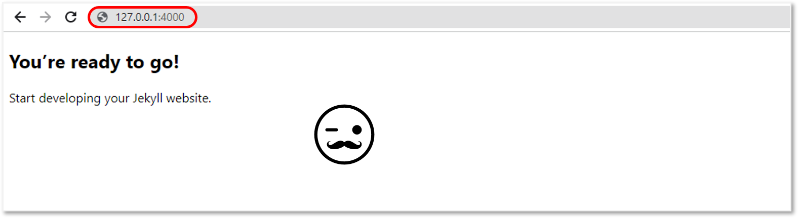
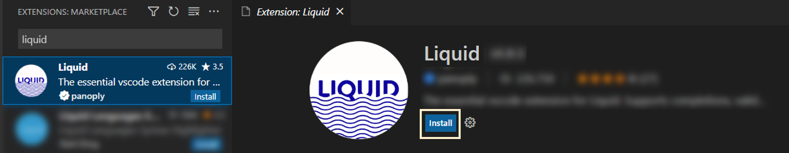
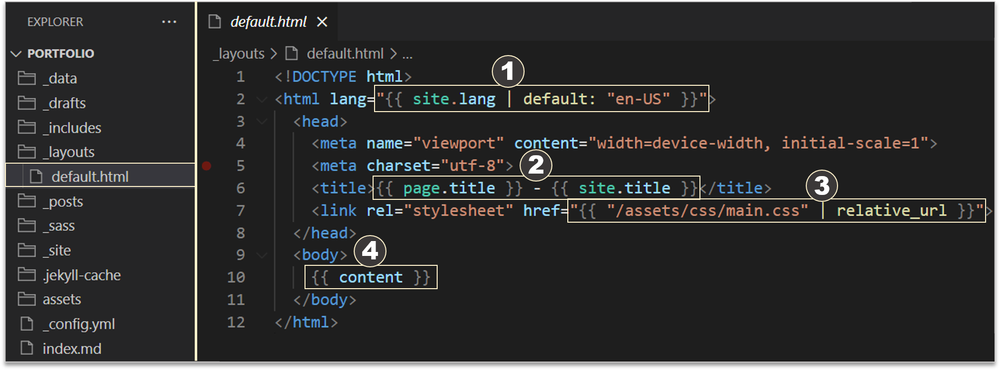
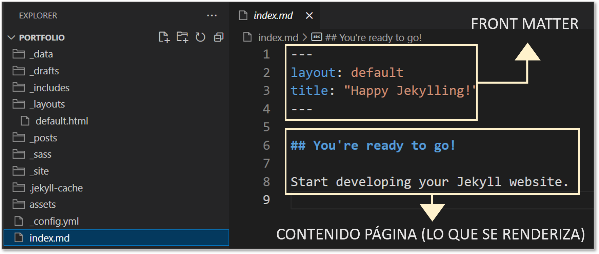
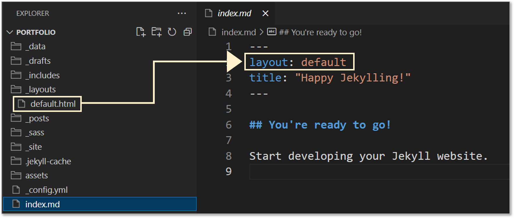
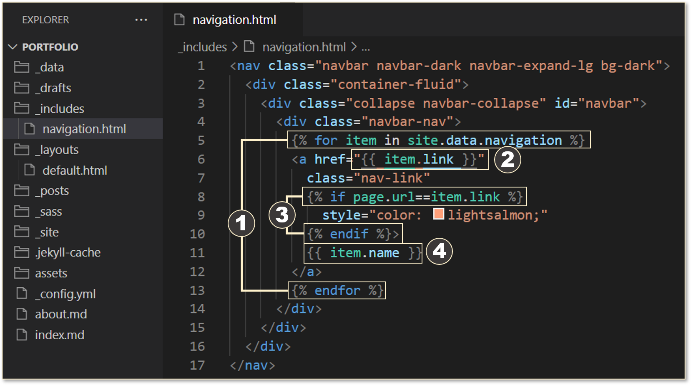

La gema **jekyll** pone a nuestra disposición un ejecutable para la terminal.

El programa **jekyll** tiene varios comandos pero la estructura es muy simple:


jekyll command [argument] [option] [argument_to_option]


- `jekyll new PATH --blank`: Crea un nuevo sitio Jekyll en blanco en la ruta especificada.
- `jekyll build || jekyll b`: Realiza una creación única de su sitio en `./_site`.
- `jekyll help`: Muestra ayuda, opcionalmente para un subcomando determinado, por ejemplo `jekyll help build`.
- `jekyll clean`: Elimina todos los archivos generados (carpeta de destino, archivo de metadatos, cachés de Sass y Jekyll)


## Comenzar un proyecto desde 0


Crear un nuevo proyecto en blanco de jekyll

{: .clipboard }
```bash
jekyll new portfolio --blank
```

Al ser un proyecto en blanco, no debería tardar demasiado en crearse y a continuación nos muestra un mensaje de que el proyecto se ha creado:

```text
New jekyll site installed in /home/user/potfolio.
```

Para entonces, podemos entrar al proyecto con el comando `cd`:

{: .clipboard }
```bash
cd portfolio
```

Dentro del proyecto ejecutamos vamos ahora a construir el proyecto y servirlo en local:

{: .clipboard }
```bash
bundle exec jekyll serve
```

Por último abrimos el navegador en [`http://127.0.0.1:4000/`](http://127.0.0.1:4000/){:target='_blank' class='link'}:




Antes de empezar a ver la estructura de carpeta y contenido de los archivos, es altamente recomendable instalar la siguiente extensión para <abbr title="visual studio code">vs code</abbr>:



---

## Estructura del proyecto

Jekyll utiliza el lenguaje de plantilla [`Liquid`](https://shopify.github.io/liquid/){:target='_blank' class='link'} para procesar los templates o plantillas como quieras decirle.

Una buena manera de comenzar a ver todo lo relacionado a las plantilla, es un buen momento para desplegar la carpeta `📁 layouts` y abrir el archivo `default.html`:



Los números indicados se explican a continuación:

1. **`{{ site.lang | default: "en-US" }}`** : este es un filtro de Liquid para facilitar el valor de la configuración del idioma. Primero buscará si existe un valor definido para la clave `lang` dentro del archivo `_config.yml`.
2. **`{{ site.lang | default: "en-US" }}`** : este filtro facilita la configuración del título de la página ( pestaña del navegador ). Primero buscará si existe un valor definido en para la clave `title` en el [`front matter`](https://jekyllrb.com/docs/front-matter/){:target='_blank' class='link'} del documento (*página actual*) o cargará el valor que define la clave `title` en el archivo `_config.yml`.
3. **`{{ "/assets/css/main.css" | relative_url }}`** : este filtro es bastante útil ya que carga el archivo de estilo en caso de que el sitio sea servido en local partiendo desde la raíz del proyecto o si el sitio esta alojado por ejemplo en **github pages** y se muestra desde un repositorio, quiere decir desde una subcarpeta.
4. **`{{ content }}`** esta es la variable global que va representar el contenido de la publicación o página que se está cargando actualmente.

Lo que tenemos entonces es nuestro contenedor para las páginas o publicaciones que escribamos en un futuro, cuando hemos visitado el sitio por primera vez tenía algo de contenido como un título y un parrado, que no es más que lo siguiente:



Como podemos observar el **front matter** es la zona de un documento para indicar que layout vamos a usar, es un sistema bien simple además podemos definir más datos en formato de **clave** - **valor** y usarlo como más nos acomode, en breve vamos a ver más casos para añadir datos en las páginas por ahora entendemos que nuestra página esta cargando el layout predeterminado que se generó cuando creamos el proyecto:




---

## Crear un menu de navegación

Ya que hemos visto la explicación sobre la estructura del proyecto, entoces vamos a trabajar el código de HTML que corresponde a la navegación aislado en la carpeta destinada para los parciales `📁 _includes`.

Antes de eso para poder facilitar los estilos para crear la barra de navegación vamos añadir el **CDN de boostrap** al layout principal.

```shell
📂 portfolio
└── 📂 _layouts
    └── default.html # 👈 layout principal
```

Y agregamos lo siguiente:

<script src="https://emgithub.com/embed-v2.js?target=https%3A%2F%2Fgithub.com%2FEniDev911%2Fassets%2Fblob%2Fmain%2Fjekyll%2F_layouts%2Fdefault.html&style=vs2015&type=code&showBorder=on&showCopy=on"></script>


Agregado boostrap. Veamos la disposición para el partial:

```shell
📂 portfolio
└── 📂 _includes
    └── navigation.html # 👈 fragmento reutilizable
```

Y dentro vamos a colocar una navegación simple como la siguiente:

<script src="https://emgithub.com/embed-v2.js?target=https%3A%2F%2Fgithub.com%2FEniDev911%2Fassets%2Fblob%2Fmain%2Fjekyll%2F_includes%2Fnavigation.html&style=vs2015&type=code&showCopy=on"></script>


Ya se que puede resultar complicado entender pero vamos a ilustrar mejor este código vamos explicar por parte:




1. **``** : dentro de estas etiquetas estamos iterando sobre un conjunto de datos que están disponibles en `_data/navigation.yml`.
2. **`<a href="{{ item.link }}">`** : por cada miembro del conjunto estamos creando un enlace y estamos definiendo su atributo `href` con el valor que tiene la clave `link` del item actual.
3. **`<a style="color: lightsalmon;"">`** : estamos evaluando si la url que de la página actual coincide con la definida el valor de la clave `item.link` y le asignamos un estilo diferente al link visitado actualmente de la navegación.


