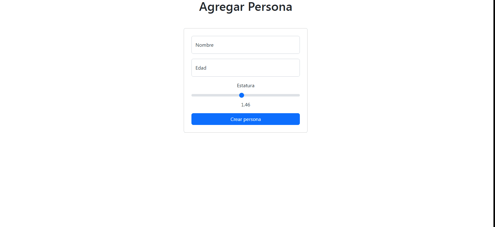

**Rails** proporciona un método llamado ***form builder*** para crear formularios que estará asociado a un objeto en particular de nuestros modelos. Usando este método nos permitirá generar campos asociados a los **atributos** basado en la instancia del objeto del modelo, lo que hace es que escribiendo una cantidad mínima de código podamos tener un formulario seguro completamente configurado y que sigue las convenciones de **Rails**.

Un ejemplo básico de ello sería el siguiente:  

```erb
<%= form_for @persona do |form| %>
 <div>
  <%= form.label :nombre %>
  <%= form.text_field :nombre %>
 </div>
 <div>
  <%= form.label :edad %>
  <%= form.number_field :edad %>
 </div>
<% end %>
```

Ahora para llegar a eso, primero debemos tener una aplicación creada, y luego generar un modelo, para ello usamos el generador de rails: 

```bash
rails g model Persona nombre edad:integer estatura:float
```

Y a continuación vamos a ejecutar el comando para crear el esquema en la base de datos por defecto que es **sqlite**:  

```bash
rails db:migrate
```

Ya con esto, podemos crear un controlador que tenga las acciones **index**, **new** y **create**:  

```bash
rails g controller personas index new create
```

A continuación abrimos el archivo del controlador y terminamos de desarrollar las acciones, como agregar una nueva instancia de nuestro modelo para usarla en la vista y construir posteriormente el formulario:  

```ruby
# app/controller/personas_controller.rb
class PersonaController < ApplicationController
  def index
    @personas = Persona.all
  end

  def new
    @persona = Persona.new
  end

  def create
    @persona = Persona.new(persona_params)

    if @persona.save
      redirect_to action: "index"
    else
      render :new, status: :unprocessable_entity
    end
  end
end
```

Ahora en nuestro archivo de `config/routes.rb`, vamos a regitrar las rutas de la siguiente manera:

```ruby
Rails.application.routes.draw do
  root 'personas#index'
  get 'personas', to: 'personas#index'
  get 'personas/new', as: "new_persona"
  post 'personas', to: 'personas#create'
end
```

### Usando form builder

Para ello creamos un nuevo archivo, en este caso, el ejemplo estará basado en **personas**, para la vista voy a estar usando clases de bootstrap para darle estilos, este formulario debemos crearlo en `app/views/personas/new.html.erb` y tendrá el siguiente contenido:  

```erb
<!-- app/views/personas/new.html.erb -->
<h1 align="center">Agregar Persona</h1>

<div class="card my-5" style="width: 400px; margin: 0 auto;">
  <%= form_with model: @persona, :class=>"p-4" do |form| %>
  <div class="form-floating mb-3">
    <%= form.text_field :nombre, 
    :class=>"form-control", 
    :placeholder=>:nombre, 
    :required=>true %>
    <%= form.label :nombre %>
  </div>
  <div class="form-floating mb-3">
    <%= form.number_field :edad, 
    :class=>"form-control", 
    :placeholder=>:edad, 
    :required=>true %>
    <%= form.label :edad, 
    :class=>"form-label" %>
  </div>
  <div class="mb-3 text-center">
    <%= form.label :estatura, 
    :class=>"form-label" %>
    <%= form.range_field :estatura,
    :onchange=>"t_altura.innerHTML=this.value",
    :class=>"form-range", 
    :min=>1, 
    :max=>2, 
    :step=>0.01, 
    :value=>0 %>
    <%= tag.span :id=>"t_altura" do %>0<% end %>
  </div>
  <div>
    <%= form.submit "Crear persona", 
    :class=>"btn btn-primary w-100" %>
  </div>
  <% end %>
</div>
```

El método **form_with** crea una instancia de un generador de formularios (*form builder*). En el bloque de **`form_with`**, se llama a los métodos **`label`** y **`text_field`** de esta forma el *form builder* generará los elementos de formulario apropiados.

El resultado en html del ejemplo anterior se vería así: 


```html
<div class="card my-5" style="width: 400px; margin: 0 auto;">
  <form class="p-4" action="/personas" accept-charset="UTF-8" method="post">
    <input type="hidden" name="authenticity_token" value="Fm.....Z07jQ" autocomplete="off">
    <div class="form-floating mb-3">
      <input class="form-control" 
        placeholder="Nombre" 
        required="required" 
        type="text" 
        name="persona[nombre]" 
        id="persona_nombre">
      <label for="persona_nombre">Nombre</label>
    </div>
    <div class="form-floating mb-3">
      <input class="form-control" 
        placeholder="Edad" 
        required="required" 
        type="number" 
        name="persona[edad]" 
        id="persona_edad">
      <label class="form-label" for="persona_edad">Edad</label>
    </div>
    <div class="mb-3 text-center">
      <label class="form-label" for="persona_altura">Altura</label>
      <input onchange="t_altura.innerHTML=this.value" 
        class="form-range" 
        min="1" max="2" 
        step="0.01" 
        value="0" 
        type="range" 
        name="persona[estatura]" 
        id="persona_altura">
      <span id="t_altura">0</span>
    </div>
    <div>
      <input type="submit" 
        name="commit" 
        value="Crear persona" 
        class="btn btn-primary w-100"
        data-disable-with="Crear persona">
    </div>
  </form>
</div>
```

Los datos del formulario enviado se colocan en **Hash** *params*, junto con los parámetros de ruta capturados. Por lo tanto, la acción del controlador **create** puede acceder al título enviado a través de `params[:persona][:nombre]` y a la edad enviada a través de `params[:persona][:edad]`. Podriamos pasar estos valores individualmente usando `Persona.new`, pero eso sería detallado y posiblemente propenso a errores. Y sería peor a medida que agregamos más campos. En su lugar, pasamos un solo **Hash**.

---

### Agregar filtros en los parámetros

Ahora agregaremos un método privado al final `app/controllers/personas_controller.rb` llamado `personas_params` para filtrar los parámetros. Y cambiamos el método **create**:

```ruby
class PersonasController < ApplicationController
  def index
    @personas = Persona.all
  end

  def show
    @persona = Persona.find(params[:id])
  end

  def new
    @persona = Persona.new
  end

  def create
    @persona = Persona.new(persona_params)

    if @persona.save
      redirect_to action: "index"
    else
      render :new, status: :unprocessable_entity
    end
  end

  private
    def persona_params
      params.require(:article).permit(:nombre, :edad, :estatura)
    end
end
```

### Resultado



