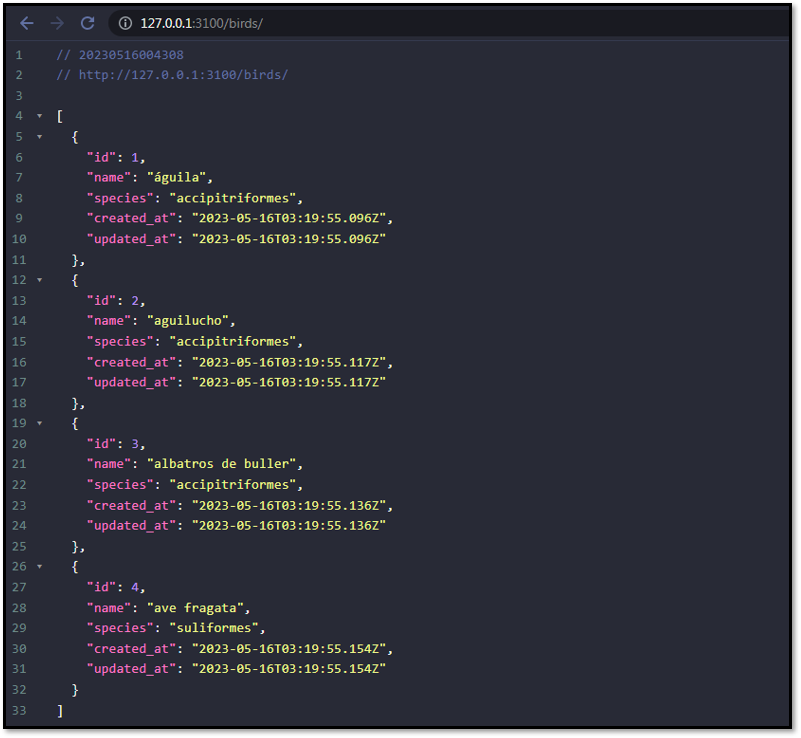
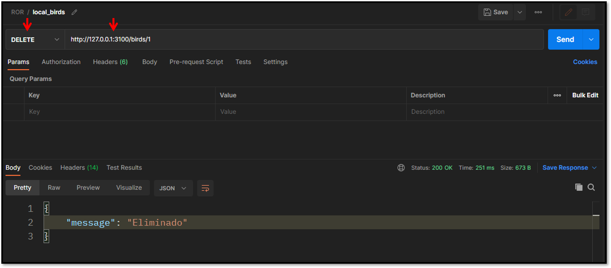

## Puesta en marcha

Para una nueva aplicación **Rails API**, lo haremos con el siguiente comando:  

```bash
rails new bird-api --api --minimal
```

Esto creará una nueva aplicación en la cual vamos a trabajar.

Luego, seguiremos avanzando y vamos a crear nuestra migración y modelo mediante el uso del **generador de Rails**:  

```bash
rails g model Birds name species
```

Este modelo preparará nuestra primera migración de una tabla de aves dos columnas, en este caso especies y nombre de formato cadena.

Entonces ya podemos ejecutar la migración con el comando:

```bash
rails db:migrate
```

Ya vamos avanzando bien, asi que podemos ir generando un controlador para manejar nuestras rutas:  

```bash
rails g controller birds
```

### Creación de rutas a mano

Avancemos y profundicemos en nuestro archivo **`route.rb`** y creemos las rutas que queremos para que nuestro controlador de pájaros para que pueda proporcionar una respuesta en formato JSON.

```ruby
Rails.application.routes.draw do
  get 'birds', to: 'birds#index'
  get 'birds/:id', to: 'birds#show'
end
```

Podemos hacer una comprobación rápida para ver si están habilitadas nuestras rutas con:  

```bash
rails routes -E -c birds
```

### Crear las acciones del controlador

Ahora configuramos rápidamente nuestras acciones de controlador para manejar nuestras rutas **RESTful** de **index** y **show**:  


```ruby
class BirdsController < ApplicationController
  def index
    render json: Bird.all, status: :ok
  end

  def show
    bird = Bird.find(params[:id])
    if bird
      render json: bird, status: :ok
    else
      render json: {error: "bird not found"}, status: 
      :not_found
    end
  end
end
```

¡Genial!. Podemos verificar si esto funciona agregando datos semilla y sembrando nuestra aplicación:


```ruby
# seeds.rb
Bird.create([
  {name: "águila", species: "accipitriformes"},
  {name: "aguilucho", species: "accipitriformes"},
  {name: "albatros de buller", species: "accipitriformes"},
  {name: "ave fragata", species: "suliformes"}
])
```

>Rails nos ofrece ese mecanismo a través del archivo `db/seeds.rb`, que nos permite escribir código Ruby y utilizar los modelos de nuestra aplicación para poblar la base de datos.

Para ejecutar este código y poblar la base de datos utilizamos el siguiente comando:

```bash
rails db:seed
```

Como resultado, tendremos datos en nuestra tabla `birds` de **sqlite**, podemos consultarlos de dos formas: 

La primer es mediante algún programa de **cli** como sqlite3.exe, donde podremos ejecutar la sentencia sql y ver los resultados:


O ingresando a la consola interactiva de **rails** con el comando:

```bash
rails console # o c (abreviado)
```

Y podemos usar el modelo y listar todos los registros:  


Ahora podemos verificar nuestra ruta RESTful para `/birds`, deberíamos ver algo similar (dependiendo de los datos iniciales):



### Automatizar rutas

Ahora refactoricemos nuestro código para automatizar las Rutas.  

Podemos hacer esto yendo al archivo `route.rb`, y dejamos comentado lo que teníamos y agreamos un *resorce*:  

```ruby
# routes.rb
Rails.application.routes.draw do
# Manual
  #get 'birds',  to: 'birds#index'
  #get 'birds/:id', to: 'birds#show'
# Automatizado 
  resource :birds, only: [:index, :show]
end
```

Ahora si verificamos nuestras rutas con `rails routes`, notaremos un problema y es que sólo se generará una ruta.   

**¿Por qué tenemos una ruta solamente?**

### Método 'resource' vs 'resources'

Al no agregar una '**`s`**' al final del método `resource`, solo generamos la acción de mostrar para el controlador **birds** en el código anterior.

Hagamos un cambio más a las rutas RESTful, ahora si dejamos solo `resorce :birds` en lugar de `only: [:index, :show]`, tendremos como resultado 5 rutas Restful:  

```bash
Prefix Verb   URI Pattern      Controller#Action
 birds GET    /birds(.:format) birds#show
       PATCH  /birds(.:format) birds#update
       PUT    /birds(.:format) birds#update
       DELETE /birds(.:format) birds#destroy
       POST   /birds(.:format) birds#create
```

Como se puede observar, hay acciones para nuestro controlador de **birds** para actualizar y destruir todos los pájaros. Con las convenciones de rutas RESTful, debemos apuntar a un pájaro específico para actualizar y destruir. Ejemplo: `http://127.0.0.1:3100/birds/?id=1`.


Ahora si hacemos otro cambio, si usamos el método de `resources` en su lugar:  

```ruby
# routes.rb
Rails.application.routes.draw do
# Manual
  #get 'birds',  to: 'birds#index'
  #get 'birds/:id', to: 'birds#show'
# Automatizado 
  # resource :birds, only: [:index, :show]
  resources:birds
end
```

Si nos fijamos, ahora obtenemos 6 rutas RESTful que realmente tienen sentido, dos para todos los pájaros `/birds` y cuatro para pájaros individuales `/birds/:id`:

```bash
Prefix Verb   URI Pattern          Controller#Action
 birds GET    /birds(.:format)     birds#index
       POST   /birds(.:format)     birds#create
  bird GET    /birds/:id(.:format) birds#show
       PATCH  /birds/:id(.:format) birds#update
       PUT    /birds/:id(.:format) birds#update
       DELETE /birds/:id(.:format) birds#destroy
```

Podemos también resolver el problema de crear la acción solo para `index` y `show` si así lo quisieramos en nuestro controlador de **birds**, simplemente escribiendo la siguiente línea en el archivo `routes.rb`:

```ruby
# routes.rb
Rails.application.routes.draw do
  resources :birds, only: [:index, :show]
end
```

Para eliminar un pájaron, sería escribir la acción `destroy` en nuestro controlador:  

```ruby
def destroy
  bird = Bird.find(params[:id])
  if bird
    bird.delete
    render json: { message: "Eliminado" }, status: :ok
  else
    render json: { error: "Ave no encontrada"}, status:
    :not_found
  end
end
```

Y ahora desde postman eliminados el primer pájaro.




## Conclusión

El caso está en los detalles, ya que omitir la '**`s`**' en los recursos cambia todo el mecanismo de automatización.

Quizás en la mayoría de los casos, vamos a usar `resources :controllers_name` y no `resource :controllers_name` al automatizar la creación de rutas RESTful.


