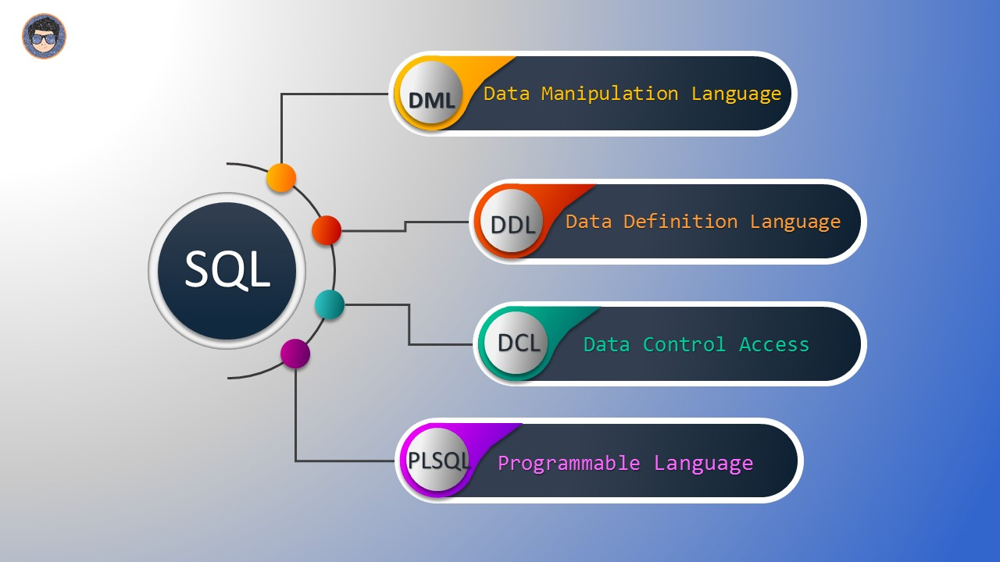

Es un lenguaje de programación **para definir estructuras de datos**, proporcionado por los sistemas gestores de bases de datos. En inglés ***Data Definition Language***, de ahí sus siglas **DDL**.

Este lenguaje permite a los programadores de un sistema gestor de base de datos, **definir las estructuras que almacenarán los datos** así como los procedimientos o funciones que permitan consultarlos.

Para definir las estructura disponemos de tres sentencias principales:

- `CREATE`: se usa para crear una base de datos, tabla, vistas, etc.
- `ALTER`: se utiliza para modificar la estructura, por ejemplo añadir o borrar columnas de una tabla.
- `DROP`: con esta sentencia, podemos eliminar objetos de la estructura, por ejemplo base de datos, tabla, índice, etc.


## Caso 1

Crear una tabla **PAISES** donde me permita identificar a cada país como único, y donde pueda registrar el nombre y su código de país según su iso:

### EJEMPLO




> **Nota**: El comando `PRIMARY KEY` me permite identificar a un campo como único dentro de la tabla, el cual no se puede **repetir** en ningún otro registro.


## Caso 2


### CREATE TABLE

**IF NOT EXISTS**:  

No arroja un error si ya existe una relación con el mismo nombre. Tener en cuenta que no hay garantía de que la relación existente sea similar a la que se habría creado.


### Ejemplos


Creamos una tabla con unas verificaciones:  

```sql
CREATE TABLE distributors (
    did     integer,
    name    varchar(40),
    CONSTRAINT con1 CHECK (did > 100 AND name <> '')
);
```

Define la columna **name** como una restricción de ser único:

```sql
CREATE TABLE distributors (
    did     integer,
    name    varchar(40) UNIQUE
);
```

Create a composite type and a typed table:

```sql
CREATE TYPE employee_type AS (name text, salary numeric);

CREATE TABLE employees OF employee_type (
    PRIMARY KEY (name),
    salary WITH OPTIONS DEFAULT 1000
);
```


### ALTER TABLE

La declaración `ALTER TABLE` de PostgreSQL para agregar una columna, modifica una columna, elimina una columna, cambiar el nombre de una columna o cambiar el nombre de una tabla.  

**SINTAXIS**  

```sql
ALTER TABLE table_name
  ADD new_column_name column_definition
  ADD new_column_name column_definition,
  ...
;
```

- **table_name**: el nombre de la tabla a modificar.
- **new_column_name**: el nombre de la nueva columna que se agregará a la tabla.
- **column_definition**: el tipo de datos de la columna.

```sql
ALTER TABLE table_name
  RENAME TO new_table_name;
```
