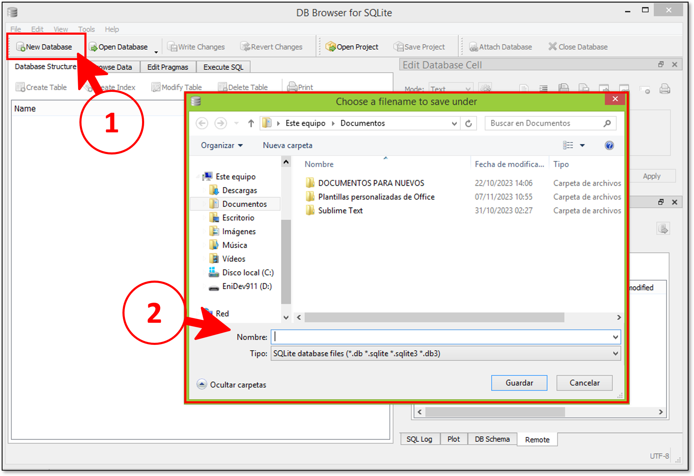
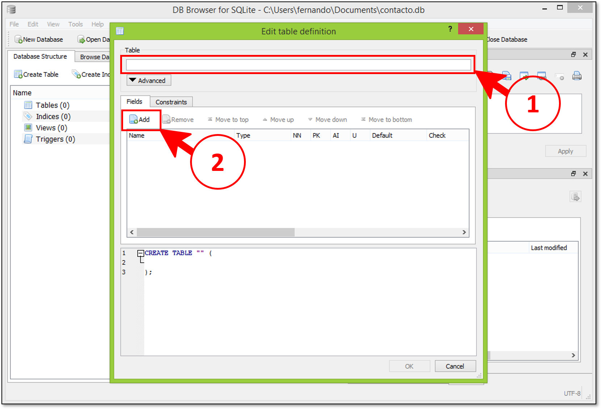
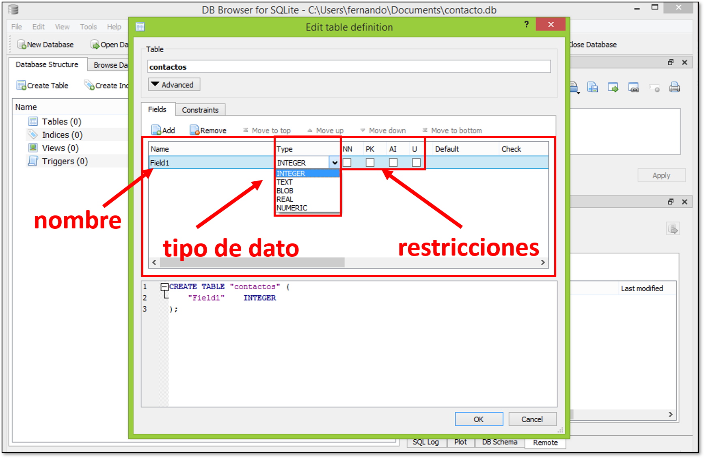
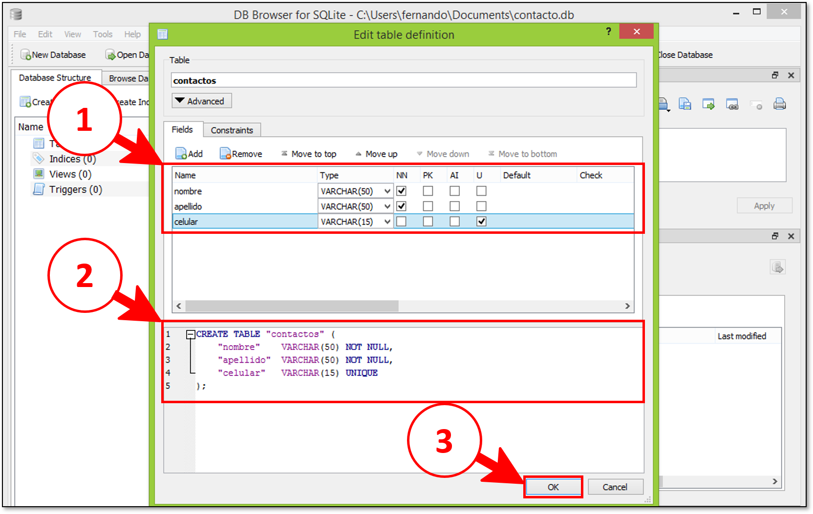
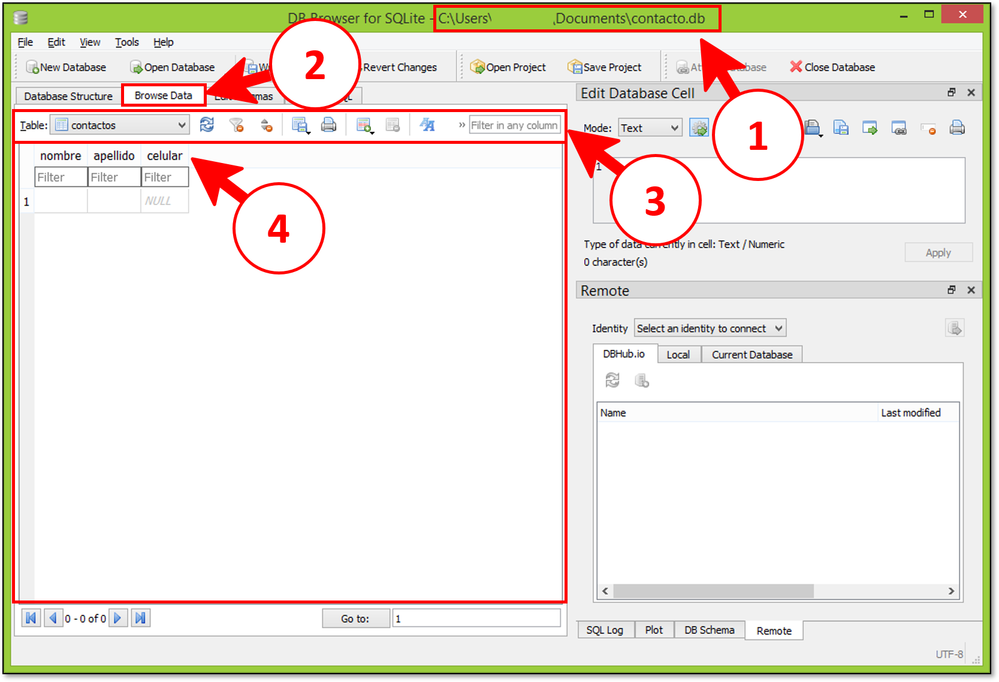
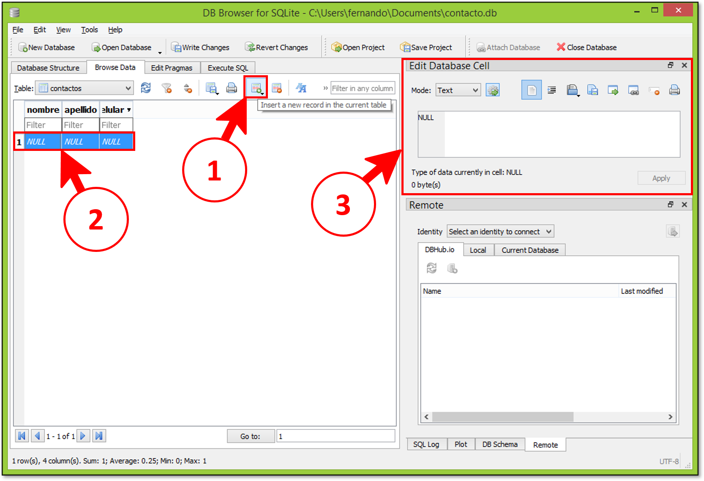

DB Browser es un software útil, gratis de código abierto que se puede utilizar para administrar, procesar y explorar bases de datos SQLite.

## Crear una base de datos

Para crear una base de datos es muy sencillo, sólo debemos realizar dos pasos:

1. Presionar el botón de nueva base de datos.
2. Elegir el destino donde se almacenará el archivo de la base de datos y dar un nombre.

---

## Crear tabla en la base de datos

Una vez creamos una base de datos inmediatamente nos permite crear una primera tabla:

1. Debemos establecer el nombre para la tabla.
2. Añadir nuevas columnas para la tabla actual.

Cuando añadimos una nueva columna se nos va añadir el recuadro de columnas:

Seguido debemos ir agregando las columnas necesarias y por último crear la tabla:

1. Tenemos 3 columnas para la tabla; nombre, apellido, celular cada una de ella de tipo texto con longitudes limitadas.
2. El código SQL generado en relación a las acciones anteriores.
3. Al darle clic en aceptar se crea la tabla en el archivo de base de datos.

---

## Agregar filas e insertar

Si observamos la pestaña examinar (*Browse data*) podremos ver los encabezados de las columnas entre otras cosas como las siguientes:

1. La ruta del archivo de base de datos que estamos conectado.
2. La pestaña del explorador de datos.
3. La barra de herramientas para manipular la tabla que seleccionamos.
4. El área de donde se presentan los datos contenido en las tablas.

Para insertar un nuevo registro, tenemos que ver lo siguiente:

1. El botón que permite añadir un nuevo registro.
2. Por defecto se presenta una fila con valores NULL, valores que podemos editar directamente dando clic en cada casilla.
3. El área para editar las celdas además nos da la posibilidad de importar, exportar y previsualizar la información que queramos ingresar.