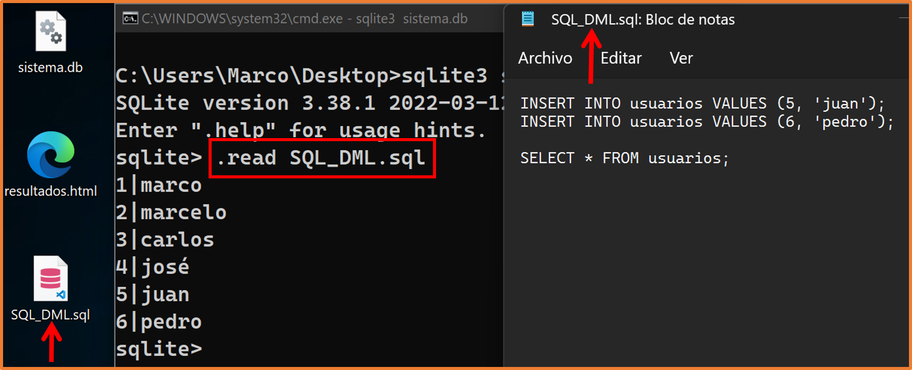

<h2 align="center">
<br><br>
Primeros Pasos
</h2> 

SQLite proporciona un programa de línea de comandos simple llamado **sqlite3** (o **sqlite3.exe** en Windows) que permite al usuario ingresar y ejecutar instrucciones SQL manualmente en una base de datos SQLite.   

Iniciamos el programa **sqlite3** escribiendo "sqlite3" en el símbolo del sistema, seguido opcionalmente por el nombre del archivo que contiene la base de datos SQlite o archivo zip. Si el archivo pasado como argumento no existe, se creará automáticamente un nuevo archivo de base de datos con el nombre dado. Si no especifica ningún archivo de base de datos en la línea de comandos, se crea una base de datos temporal y se elimina automáticamente cuando se cierra el programa "sqlite3".  

Al iniciarse, el programa **sqlite3** mostrará un breve mensaje de banner y luego le perdirá que ingrese instrucciones SQL. Cada sentencia SQL debe terminar con un punto y coma.  

Por ejemplo, para crear una nueva base de datos SQLite llamada "`sistema.db`" con una tabla llamada "`usuarios`":  


Para salir del programa sqlite3 solo debe escribir **`.q`** o con <kbd>Ctrl</kbd> + <kbd>c</kbd> y luego <kbd>Enter</kbd>.

--- 

<h2 align="center">
Comandos especiales
</h2> 

La mayoría de las veces, sqlite3 solo lee líneas de entrada y las pasa a la biblioteca SQLite para su ejecución. Pero las líneas de entradas que comienzan con un (**`"."`**) son interceptadas e interpretadas por el propio programa sqlite3. Estos comandos de puntos se utilizan normalmente para cambiar el formato de salida de las consultas o para ejecutar ciertas declaraciones de consulta preempaquetadas. Originalmente, solo había unos pocos comandos de puntos (*dot-commands*), pero a lo largo de los años se han acumulado muchas funciones nuevas, de modo que hoy existen más de 60.  

Para obtener una lista de comandos de puntos disponibles, puede ingresar **`.help`** sin argumentos o ingrese **`.help TOPIC`** para obtener información detallada sobre TOPIC. La lista de comandos de puntos disponible es la siguiente:  

|Comando|Descripción|Predeterminado|
|-------|-----------|--------------|
|[**`.archive`**](#)| Administrar archivos SQL|
|**`.auth`** **ON\|OFF**|Mostrar devoluciones de llamada del autorizador|**OFF**|
|[**`.backup`**](#backup) **?DB? FILE**|Crea un respaldo de la base de datos actual a el **`<file>`** especificado|**MAIN**|
|**`.bail`** **ON\|OFF**|Detener después de encontrar un error|**OFF**|
|**`binary`** **ON\|OFF**|Activa o desactiva la salida binaria.|**OFF**|
|**`.cd`** **DIR**|Cambiar el directorio de trabajo al nuevo directorio especificado|**./** (actual)|
|**`.changes`** **ON\|OFF**|Mostrar el número de filas modificadas por SQL|**OFF**|
|**`.check`** **GLOB**|Fallo si la salida no coincide ya que `.testcase`|**OFF**|
|**`.databases`**|Lista nombres y archivos de bases de datos adjuntas|**./** (actual)|
|**`.dbconfig`** **?** **val?**|Listar o cambiar las opciones de `sqlite3_db_config()`|**.**|
|**`.dump`** **?** **OBJECTS**|Representar el contenido de la base de datos como SQL|**.**|
|**[`.excel`](#)** **?** **val?**|Mostrar el resultado del siguiente comando en la hoja de cálculo|**.**|
|[**`.mode`**](#mode)|Cambia el formato de salida puede cambiar entre: (**ascii**, **box**, **csv**, **column**,**html**, **insert**, **json**, **line**, **list**, **markdown**, **quote**, **table**, **tabs**, **tcl**)|**LIST**|
|**`.separator`**| Cambia el separador de columnas, este se ve afectado según el `.mode` es posible que deba repetir este comando dependiendo el modo.|
|**`.width`**|Un ancho de 0 significa que el ancho de la columna se elige automáticamente. Por lo tanto, el comando sin argumento restablece todos los anchos de columnas a cero. Ej `.width 2 8`|
|**`.open`**|Cierra la base de datos actual y abre el archivo especificado, si no existe, lo crea|
|[**`.output`**](#output)|Enviar salida a ARCHIVO o salida estándar si se omite ARCHIVO|
|[**`.prompt`**](#prompt)|Cambia el prompt por el nuevo argumento|
|**`.quit`** o **`.q`**|Salir del programa|
|**`.schema`**|Muestra las sentencias ejecutadas para la creación del schema|
|[**`.shell`**](#)|Ejecutar CMD ARGS.. en un shell del sitema|
|**`.system`**|Ejecutar CMD ARGS.. en un shell del sitema|
|**`.show`**|Muestra los valores actuales para varias configuraciones|
|[**`.tables`**](#tables)|Enumera los nombres de las tablas puede utilizarlo para buscar patrones Ej: (`.tables ima%`)|


<a name="output"></a>
### Escribir resultados en un archivo

De forma predeterminada, sqlite3 envía los resultados de la consulta a la salida estándar. Podemos cambiar esto usando los comandos **`.output`** y **`.once`**. Simplemente pasamos el nombre de un archivo de salida como argumento para el comando **`output`** y todos los resultados de la consulta posterior se escribirán en ese archivo. Ejemplo:  


<a name="read"></a>
### Leer SQL desde un archivo

En el modo interactivo, sqlite3 lee el texto de entrada (ya sean instrucciones SQL o **dot-command** - comandos de puntos) desde el teclado. El comando **`.read`** toma un solo argumeto que es el nombre de un archivo desde el cual se quiere ller el texto de entrada.



El comando **`.read`** deja de leer temporalmente desde el teclado y en su lugar toma su entrada del archivo nombrado. Al llegar al final del archivo, la entrada vuelve al teclado. El achivo de secuencia de comandos puede contener **dot-command**.  

#### SQLite: Funciones de E/S de archivo

El shell de la línea de comandos agrega dos funciones SQL definidas por la aplicación que facilitan la lectura del contenido de un archivo en una columna de la tabla y la escritura del contenido de una columna en un archivo, respectivamente.  

La función **`readfile(X)`** lee todo el contenido del archivo X y devuelve ese contenido como un **BLOB**. Esto se puede usar para cargar contenido en una tabla. Por ejemplo:  

```sqlite3
sqlite> CREATE TABLE imagenes(nombre TEXT, tipo TEXT, imagen BLOB);
sqlite> INSERT INTO imagenes(nombre,tipo,imagen)
   ...> VALUES('icon','jpeg',readfile('icon.jpg'));
```

La función SQL **`writefile(X, Y)`** escribe el blob **`Y`** en el archivo llamado **`X`** y devuelve el número de bytes escritos. Utilice esta función para extraer el contenido en una tabla. Por ejemplo:  

```sqlite3
sqlite> SELECT writefile('icon.jpg', imagen) FROM imagenes WHERE nombre = 'icono');
```

<a name="tables"></a>
### Consulta del esquema de la base de datos

El programa sqlite3 proporciona varios comandos de conveniencia que son útiles para mirar el esquema de la base de datos. No hay nada de lo que hacen estos comandos que no se pueda hacer por otros medios. Estos comandos se proporcionan simplemente como un atajo.  


Para ver una lista de las tablas de la base de datos, se puede introducir `.tables`

```sqlite3
sqlite> .tables
category  details   product
sqlite>
```

Ahora para ver el esquema, donde veremos las sentencias SQL ejecutadas para la definición del esquema usamos `.schema` o `.fullschema`

```sqlite3
sqlite> .fullschema --indent
CREATE TABLE IF NOT EXISTS "schema_migrations"("version" varchar NOT NULL PRIMARY KEY);
CREATE TABLE IF NOT EXISTS "ar_internal_metadata"(
  "key" varchar NOT NULL PRIMARY KEY,
  "value" varchar,
  "created_at" datetime(6) NOT NULL,
  "updated_at" datetime(6) NOT NULL
);
CREATE TABLE IF NOT EXISTS "birds"(
  "id" integer PRIMARY KEY AUTOINCREMENT NOT NULL,
  "name" varchar,
  "species" varchar,
  "created_at" datetime(6) NOT NULL,
  "updated_at" datetime(6) NOT NULL
);
sqlite>
```
   
El comando `.tables` es similar a configurar el modo de lista y luego ejecutar la siguiente consulta:  

```sql
SELECT name FROM sqlite_schema 
WHERE type IN ('table','view') AND name NOT LIKE 'sqlite_%'
ORDER BY 1
```
