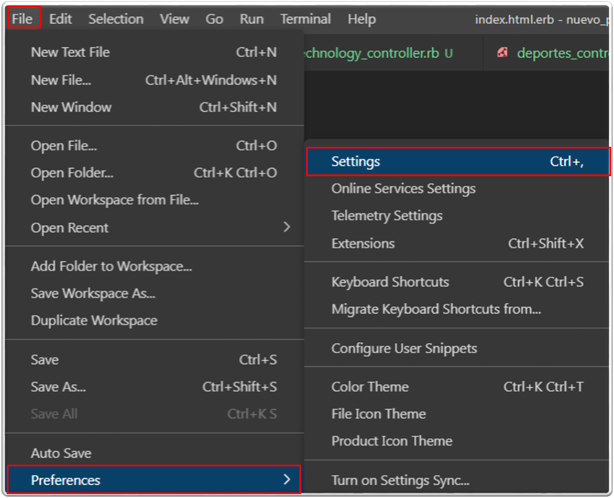

Desde el menú Código, seleccione Preferencias, seleccione Configuración:

<p align="center">
	
</p>


En las configuraciones buscamos el icono para abrir el archivo **JSON** de las configuraciones y agregamos las siguientes líneas:


```json
"emmet.includeLanguages": {
    "erb": "html"
}
```  


